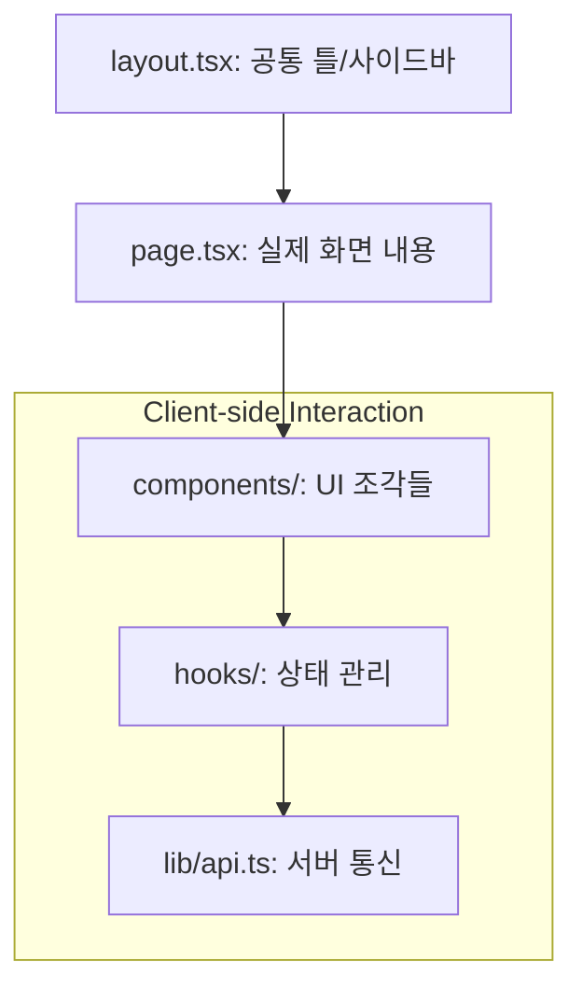
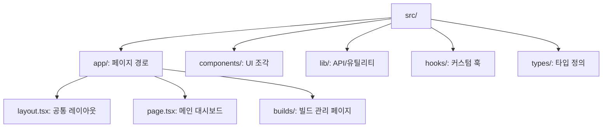
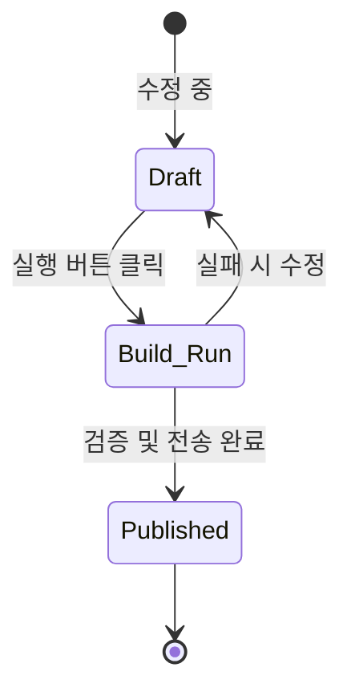

# AGENTS.md — kpubdata-studio

## Mission

Implement KPubData Studio as the UI shell and workflow interface for `kpubdata-builder`.

## Ground Rules

- Studio must not reimplement builder logic
- Prefer explicit UI state transitions
- Keep generated specs portable
- Surface validation and manifests clearly
- Make preview a first-class feature

## Language policy

- **Documentation**: Write in Korean by default. English expansion is planned for future releases.
- **Code**: All code (variable names, function names, comments, docstrings) must be in English.
- **Commit messages**: Always in English.
- **Issue / PR titles and descriptions**: Korean is acceptable; English is also fine.

## Priorities

1. information architecture
2. build draft state
3. builder API integration layer
4. preview and validation views
5. artifact viewer
6. publish flow

---

## 이 프로젝트 이해하기

KPubData Studio는 `kpubdata-builder` 출판사에서 만드는 **책(데이터셋)을 기획하고 미리보는 작업실**과 같습니다. 코딩 없이 버튼 몇 번으로 어떤 데이터를 가져올지 정하고, 결과가 어떻게 나올지 눈으로 확인하며 최종 출판까지 관리하는 웹 화면입니다.

### 핵심 개념 용어 사전

| 용어 | 설명 |
| :--- | :--- |
| **Draft** | 아직 저장되지 않은 임시 기획 상태 (편집 중) |
| **Build Run** | 실제로 빌드를 돌려 데이터를 가져오는 과정 |
| **Preview** | 빌드 결과물을 미리 눈으로 확인하는 화면 |
| **State Model** | 기획(Draft)부터 실행(Run), 출판(Publish)까지의 상태 흐름도 |
| **Studio Shell** | 전체 웹 화면을 구성하는 기본 틀과 내비게이션 |
| **UI Spec** | 화면의 각 요소가 어떻게 보이고 반응해야 하는지에 대한 약속 |

### 이 프로젝트의 코드가 실행되는 흐름 (Next.js App Router)



```text
[Layout (Header/Sidebar)] -> [Page (Content)] -> [Components (Buttons/Cards)]


## AI 에이전트 코딩 가이드

### 좋은 프롬프트 예시
- "`app/builds/new` 경로에 새 빌드 기획서를 만드는 페이지를 추가해줘."
- "`components/PreviewCard` 컴포넌트의 스타일을 Tailwind CSS로 수정해줘."

### 에이전트 금지 사항
- **빌더 로직 중복 금지**: 데이터 수집 로직은 직접 짜지 말고 `kpubdata-builder` API를 호출하세요.
- **상태 관리 누락 금지**: 페이지 이동 시 기획서의 임시 저장 상태(Draft)가 유지되도록 하세요.
- **Client/Server 컴포넌트 혼동 금지**: `use client` 지시어를 필요한 곳에만 정확히 사용하세요.

### 에이전트 결과물 검증 체크리스트
- [ ] `npm run lint`를 통과했는가?
- [ ] 새로운 페이지가 Sidebar 내비게이션에 포함되었는가?
- [ ] 반응형 디자인이 모바일에서도 깨지지 않는가?

## 파일 구조 가이드



```text
src/
├── app/             # Next.js App Router (페이지 경로 정의)
│   ├── layout.tsx   # 공통 레이아웃 (헤더, 사이드바)
│   ├── page.tsx     # 메인 대시보드
│   └── builds/      # 빌드 관리 관련 페이지들
├── components/      # 재사용 가능한 UI 조각들 (버튼, 입력창 등)
├── lib/             # API 호출 및 공통 유틸리티 함수
├── hooks/           # 리액트 커스텀 훅 (상태 관리, 데이터 가져오기 등)
└── types/           # 타입스크립트 타입 정의
```

### 이 파일을 수정해야 할 때
- **새로운 화면(URL)을 만들고 싶을 때**: `app/` 아래에 폴더와 `page.tsx`를 만듭니다.
- **모든 화면에서 똑같이 보이는 디자인을 바꿀 때**: `app/layout.tsx`를 수정합니다.
- **여러 페이지에서 쓰는 똑같은 UI(예: 데이터 표)를 바꿀 때**: `components/` 폴더 안의 파일을 수정합니다.

## Next.js 및 개발 가이드

### Next.js 기초 (초보자용)
- `page.tsx`: 실제 웹사이트의 주소(URL)가 되는 파일입니다.
- `layout.tsx`: 해당 폴더 아래의 모든 페이지에 공통으로 적용되는 디자인(헤더, 푸터 등)을 담는 틀입니다.
- `use client`: 사용자의 클릭이나 입력에 반응하는 기능이 필요할 때 파일 맨 위에 적어줍니다.

### 새 페이지 추가하는 방법
1. `src/app/` 아래에 원하는 경로 이름으로 폴더를 만듭니다 (예: `src/app/my-page/`).
2. 그 폴더 안에 `page.tsx` 파일을 만들고 화면 내용을 코딩합니다.
3. 브라우저에서 `localhost:3000/my-page`로 접속하여 확인합니다.

### State Model 설명
사용자가 작업을 시작하면 데이터는 다음 순서로 상태가 변합니다:



- **Draft**: 사용자가 내용을 고치고 있는 상태입니다. (수정 중)
- **Build Run**: '실행' 버튼을 눌러 실제로 데이터를 모으는 중입니다.
- **Published**: 모든 검증을 마치고 결과물이 공유된 상태입니다.

---

## 📚 관련 문서

### 이 저장소 내 문서
| 문서 | 설명 |
| :--- | :--- |
| [CONTRIBUTING.md](./CONTRIBUTING.md) | 기여 가이드 |
| [ARCHITECTURE.md](./ARCHITECTURE.md) | 시스템 아키텍처 |
| [STATE_MODEL.md](./STATE_MODEL.md) | 상태 관리 모델 |
| [UI_SPEC.md](./UI_SPEC.md) | UI 디자인 규격 |
| [USER_FLOWS.md](./USER_FLOWS.md) | 사용자 흐름도 |
| [INFORMATION_ARCHITECTURE.md](./INFORMATION_ARCHITECTURE.md) | 정보 구조 설계 |
| [API_CONTRACT.md](./API_CONTRACT.md) | API 연동 규약 |
| [PRD.md](./PRD.md) | 제품 요구사항 |
| [ROADMAP.md](./ROADMAP.md) | 개발 로드맵 |

### KPubData Product Family
| 저장소 | 문서 | 설명 |
| :--- | :--- | :--- |
| [kpubdata](https://github.com/yeongseon/kpubdata) | [AGENTS.md](https://github.com/yeongseon/kpubdata/blob/main/AGENTS.md) | Core 에이전트 가이드 |
| [kpubdata-builder](https://github.com/yeongseon/kpubdata-builder) | [AGENTS.md](https://github.com/yeongseon/kpubdata-builder/blob/master/AGENTS.md) | Builder 에이전트 가이드 |

