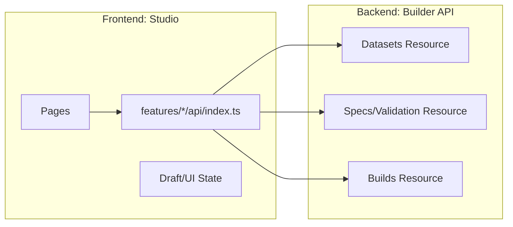
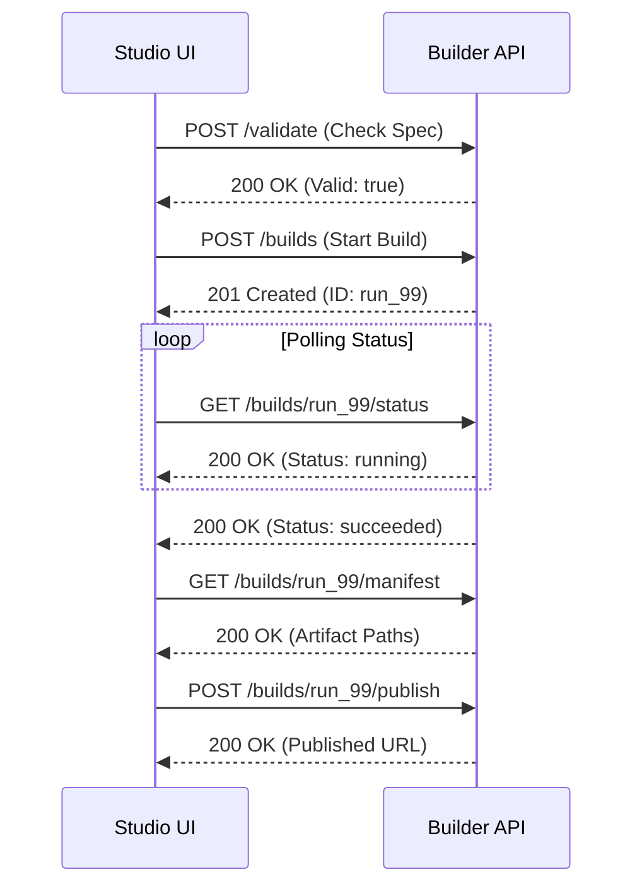
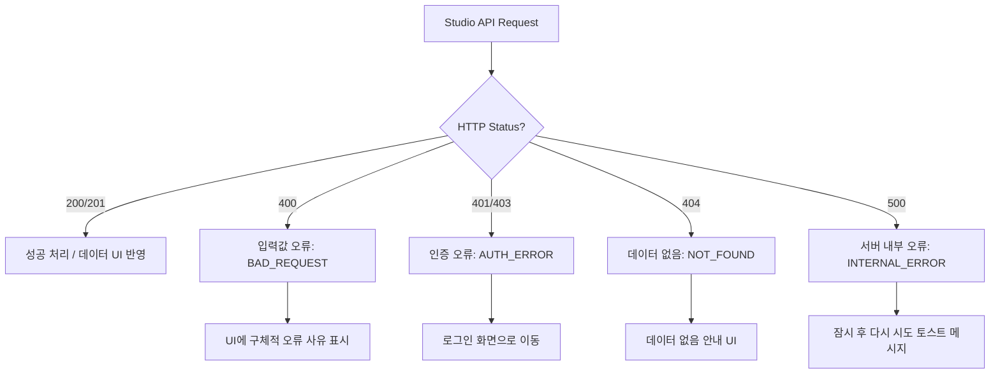

# API Contract — KPubData Studio

## 1. Overview
Studio(프론트엔드)가 Builder API(백엔드)와 대화할 때 사용하는 약속입니다. 모든 데이터는 JSON 형식으로 주고받습니다.



---

## 2. API Endpoints 상세

### 2.0 Feature-based API 구조

Studio는 엔드포인트를 페이지에서 직접 호출하지 않고, 기능별 API 진입점을 통해 Builder API를 사용합니다.

| Feature | API 진입점 | 주요 책임 |
| :--- | :--- | :--- |
| Build Spec | `src/features/build-spec/api/index.ts` | 기획 입력 관련 요청 조립 |
| Preview | `src/features/preview/api/index.ts` | 샘플 데이터 미리보기 요청 |
| Validation | `src/features/validation/api/index.ts` | 기획 검증 요청 |
| Runs | `src/features/runs/api/index.ts` | 빌드 실행 및 상태 조회 |
| Artifacts | `src/features/artifacts/api/index.ts` | 결과물/manifest 조회 |
| Publish | `src/features/publish/api/index.ts` | 출판 요청 |

원칙:
- 페이지는 feature API를 호출한다.
- feature API는 Builder의 HTTP 계약을 캡슐화한다.
- 공통 타입은 `src/shared/lib/types.ts` 등 shared 계층에서 재사용한다.

### [Datasets] 데이터 정보 조회

#### `GET /providers`
사용 가능한 데이터 제공 기관 목록을 가져옵니다.

**Request:** None
**Response Example:**
```json
[
  { "id": "datago", "name": "공공데이터포털" },
  { "id": "kma", "name": "기상청" }
]
```

---

### [Build Specs] 기획서 관리

#### `POST /validate`
현재 빌드 기획서(Build Spec)에 오류가 없는지 검사합니다.

**Request Example:**
```json
{
  "datasetId": "weather_report",
  "sources": [{ "provider": "kma", "dataset": "forecast", "params": { "region": "seoul" } }]
}
```

**Response Example (Success):**
```json
{ "valid": true, "errors": [] }
```

**Response Example (Error):**
```json
{ 
  "valid": false, 
  "errors": ["region 파라미터가 누락되었습니다."] 
}
```

---

### [Builds] 빌드 실행 및 상태

#### `POST /builds`
실제로 빌드 작업을 시작합니다.

**Request Body:** `BuildSpec` 객체
**Response Example:**
```json
{
  "id": "run_99",
  "status": "queued",
  "startedAt": "2024-04-05T10:00:00Z"
}
```

#### `GET /builds/:id/status`
진행 중인 빌드의 상태와 실시간 로그를 가져옵니다.

**Response Example:**
```json
{
  "id": "run_99",
  "status": "running",
  "logs": ["10:00:05 - 데이터 수집 중...", "10:00:08 - 50% 완료"]
}
```



---

## 3. TypeScript 타입 정의 (Type Mapping)

Studio의 코드(`src/shared/lib/types.ts`)에서 사용하는 핵심 타입들입니다. Builder API의 snake_case 필드를 Studio의 camelCase로 변환하여 사용합니다.

> **필드명 변환 규칙**: Builder API 응답은 `snake_case`(예: `build_id`, `spec_digest`, `started_at`)이고, Studio TypeScript 타입은 `camelCase`(예: `buildId`, `specDigest`, `startedAt`)입니다. 변환은 `src/features/*/api/index.ts` 또는 shared API 유틸리티 레이어에서 수행합니다.

```typescript
export interface BuildSpec {
  datasetId: string;
  title: string;
  sources: SourceRef[];
  exports: ExportTarget[];
}

export interface SourceRef {
  provider: string;
  dataset: string;
  params: Record<string, string>;
}

export type ManifestStatus = "succeeded" | "failed" | "partial";
export type SourceBuildStatus = "succeeded" | "failed" | "pending";

export interface SourceManifest {
  provider: string;
  dataset: string;
  status: SourceBuildStatus;
  recordsFetched?: number;
  error?: string;
}

export interface BuildManifest {
  buildId: string;
  status: ManifestStatus;
  specDigest: string;
  startedAt: string;
  finishedAt: string;
  sources: SourceManifest[];
  artifactPaths: string[];
  recordCount: number;
  warnings: string[];
  errors: string[];
}
```

### 3.1 Builder ↔ Studio 필드 매핑 테이블

| Builder (snake_case) | Studio (camelCase) | 타입 | 설명 |
|:---|:---|:---|:---|
| `build_id` | `buildId` | `string` | 빌드 고유 식별자 |
| `status` | `status` | `ManifestStatus` | 빌드 결과 상태 |
| `spec_digest` | `specDigest` | `string` | 기획서 해시 (기획서 변경 추적용) |
| `started_at` | `startedAt` | `string` (ISO 8601) | 빌드 시작 시각 |
| `finished_at` | `finishedAt` | `string` (ISO 8601) | 빌드 완료 시각 |
| `sources[].provider` | `sources[].provider` | `string` | 데이터 제공 기관 |
| `sources[].dataset` | `sources[].dataset` | `string` | 데이터셋 이름 |
| `sources[].status` | `sources[].status` | `SourceBuildStatus` | source별 실행 결과 |
| `sources[].records_fetched` | `sources[].recordsFetched` | `number?` | 수집된 레코드 수 |
| `sources[].error` | `sources[].error` | `string?` | source별 에러 메시지 |
| `artifact_paths` | `artifactPaths` | `string[]` | 생성된 파일 경로 |
| `record_count` | `recordCount` | `number` | 총 레코드 수 |
| `warnings` | `warnings` | `string[]` | 경고 메시지 목록 |
| `errors` | `errors` | `string[]` | 에러 메시지 목록 |

---

## 4. 에러 응답 표준 (Error Format)
API 호출에 실패했을 때 서버가 보내주는 표준 에러 형식입니다.

```json
{
  "error": "BAD_REQUEST",
  "message": "지원하지 않는 파일 형식입니다.",
  "details": ["format must be one of: json, markdown, parquet"]
}
```

### 4.1 Builder 에러 코드 매핑

Builder API가 반환하는 에러 코드와 Studio에서의 처리 방법입니다.

| Builder 에러 코드 | HTTP Status | Studio 처리 |
|:---|:---|:---|
| `SPEC_LOAD_ERROR` | 400 | 기획서 로딩 실패 메시지 표시 |
| `SPEC_VALIDATION_ERROR` | 422 | 필드별 검증 오류 인라인 표시 |
| `SOURCE_EXECUTION_ERROR` | 502 | source별 실패 상태 + 재시도 버튼 |
| `ASSEMBLY_ERROR` | 500 | 데이터 조립 실패 메시지 표시 |
| `EXPORT_ERROR` | 500 | 파일 생성 실패 메시지 표시 |
| `MANIFEST_WRITE_ERROR` | 500 | 서버 내부 오류 토스트 |
| `PUBLISH_ERROR` | 502 | 배포 실패 + 재시도 버튼 |

### 4.2 Manifest 상태별 UI 표시

| Manifest Status | 의미 | UI 표시 |
|:---|:---|:---|
| `succeeded` | 전체 성공 | 성공 배지 + 결과 요약 |
| `failed` | 전체 실패 | 에러 배지 + `errors[]` 표시 + source별 실패 원인 |
| `partial` | 부분 실패 | 경고 배지 + 성공/실패 source 구분 표시 |

> **참고**: Builder의 에러 계층 및 처리 정책은 [kpubdata-builder/docs/ERROR_HANDLING.md](https://github.com/yeongseon/kpubdata-builder/blob/main/docs/ERROR_HANDLING.md)를 참조하세요.



---

## 관련 문서

### 이 저장소 내 문서
| 문서 | 설명 |
| :--- | :--- |
| [ARCHITECTURE.md](./ARCHITECTURE.md) | 시스템 아키텍처 설계 |
| [STATE_MODEL.md](./STATE_MODEL.md) | 상태 관리 모델 |

### KPubData Product Family
| 저장소 | 문서 | 설명 |
| :--- | :--- | :--- |
| [kpubdata](https://github.com/yeongseon/kpubdata) | [API_SPEC.md](https://github.com/yeongseon/kpubdata/blob/main/API_SPEC.md) | Core API 명세 |
| [kpubdata-builder](https://github.com/yeongseon/kpubdata-builder) | [API_CONTRACT.md](https://github.com/yeongseon/kpubdata-builder/blob/main/API_CONTRACT.md) | Builder API 규약 |
