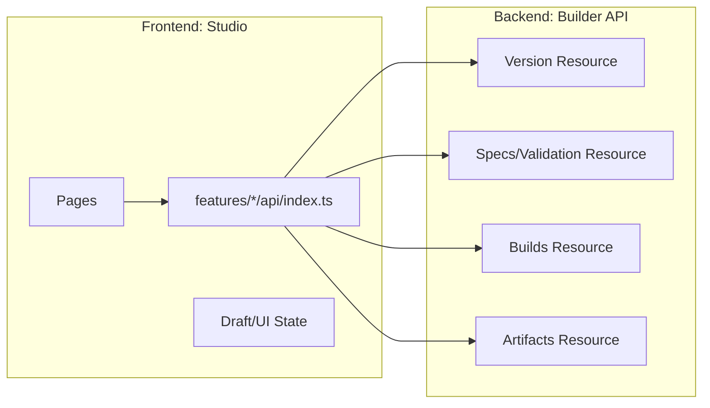
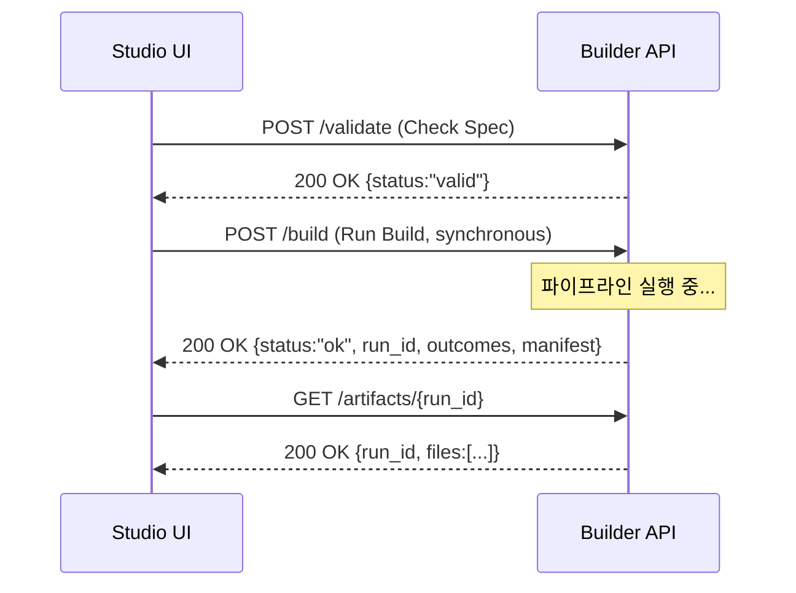
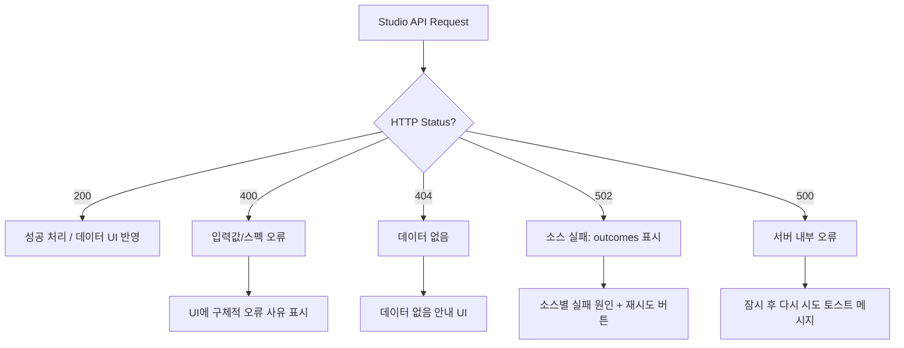

# API 규약 — KPubData Studio

## 1. 개요
Studio(프론트엔드)가 Builder API(백엔드)와 대화할 때 사용하는 약속입니다. 모든 데이터는 JSON 형식으로 주고받습니다.



---

## 2. API 엔드포인트 상세

> ⚠️ **이 섹션은 초기 설계 스캐폴드입니다.** 여기 적힌 `/providers`·`/builds`·
> `/builds/:id/status` 등은 설계 시안이며, Studio가 **실제로 호출하는 엔드포인트와
> 와이어 형태**는 아래 [Builder 통합 현황](#builder-통합-현황-36) 및
> `src/shared/lib/builderApi.ts`(`/version`·`/validate`·`/build`·`/artifacts/{run_id}`)를
> 기준으로 합니다. 두 섹션이 다르면 통합 현황 쪽이 최신입니다.

### 2.0 기능 기반 API 구조

Studio는 엔드포인트를 페이지에서 직접 호출하지 않고, 기능별 API 진입점을 통해 Builder API를 사용합니다.

| 기능 | API 진입점 | 주요 책임 |
| :--- | :--- | :--- |
| Build Spec | `src/features/build-spec/api/index.ts` | 기획 입력 관련 요청 조립 |
| Preview | `src/features/preview/api/index.ts` | 샘플 데이터 미리보기 요청 |
| Validation | `src/features/validation/api/index.ts` | 기획 검증 요청 |
| Runs | `src/features/runs/api/index.ts` | 빌드 실행 및 결과 조회 |
| Artifacts | `src/features/artifacts/api/index.ts` | 결과물/파일 목록 조회 |

원칙:
- 페이지는 feature API를 호출합니다.
- feature API는 Builder의 HTTP 계약을 캡슐화합니다.
- 공통 타입은 `src/shared/lib/types.ts` 등 shared 계층에서 재사용합니다.

### [Version] 버전 확인

#### `GET /version`
Builder API의 계약 버전을 확인합니다. Studio가 기동 시 호환성을 검증하는 데 사용합니다.

**요청:** 없음
**응답 예시:**
```json
{ "service": "kpubdata-builder", "api_version": "1.0.0" }
```

---

> **계획(planned)/미구현**: 데이터 제공 기관 목록(`GET /providers`)은 아직 Builder API에 존재하지 않습니다.
> 현재 Studio의 Provider 선택 UI는 하드코딩된 목록을 사용합니다. 향후 동적 조회 엔드포인트로 교체할 예정입니다.

---

### [Build Specs] 기획서 관리

#### `POST /validate`
현재 빌드 기획서(Build Spec)에 오류가 없는지 검사합니다.

**요청 예시 (body에 YAML 문자열로 전달):**
```json
{ "spec": "dataset_id: weather_report\nsources:\n  - provider: kma\n    ..." }
```

**응답 예시 (성공):**
```json
{ "status": "valid", "dataset_id": "weather_report", "api_version": "1.0.0" }
```

**응답 예시 (검증 실패, HTTP 400):**
```json
{
  "status": "invalid",
  "problems": ["'region' 파라미터가 누락되었습니다."]
}
```

**응답 예시 (스펙 로딩 오류, HTTP 400):**
```json
{ "status": "error", "error": "top-level YAML must be a mapping" }
```

#### `POST /preview`
각 소스의 스키마와 샘플 행을 반환합니다 (파일 미기록).

**요청 예시:**
```json
{ "spec": "...", "limit": 5 }
```

**응답 예시:**
```json
{
  "dataset_id": "weather_report",
  "previews": [
    {
      "source_key": "kma__forecast",
      "status": "ok",
      "schema": [{ "name": "date", "dtype": "Utf8", "nullable": false, "unique_count": 30 }],
      "sample": [["2024-04-01"]],
      "total_rows": 30
    }
  ]
}
```

---

### [Builds] 빌드 실행

#### `POST /build`
빌드 파이프라인을 동기적으로 실행하고 완료 후 결과를 반환합니다.

> **참고**: 이 엔드포인트는 **동기식(synchronous)**입니다. 빌드가 완료될 때까지 응답을 반환하지 않습니다.
> 비동기 폴링(`POST /builds`, `GET /builds/:id/status`)은 계획(planned)/미구현 상태입니다.

**요청 본문:**
```json
{ "spec": "...", "run_id": "run_99" }
```
(`run_id`는 선택 사항이며, 생략 시 서버가 자동 생성합니다.)

**응답 예시 (전체 성공, HTTP 200):**
```json
{
  "status": "ok",
  "run_id": "run_99",
  "outcomes": [
    { "source_key": "kma__forecast", "status": "ok", "stages_completed": ["bronze", "silver"], "error": null }
  ],
  "manifest": "output/run_99/manifest.json",
  "api_version": "1.0.0"
}
```

**응답 예시 (하나 이상의 소스 실패, HTTP 502):**
```json
{
  "status": "failed",
  "run_id": "run_99",
  "outcomes": [
    { "source_key": "kma__forecast", "status": "failed", "stages_completed": [], "error": "upstream API timeout" }
  ],
  "manifest": "output/run_99/manifest.json",
  "api_version": "1.0.0"
}
```



> **계획(planned)/미구현**: 비동기 빌드 폴링(`GET /builds/:id/status`), manifest 직접 조회(`GET /builds/:id/manifest`), 게시 트리거(`POST /builds/:id/publish`)는 아직 구현되지 않았습니다.

---

### [Artifacts] 결과물 조회

#### `GET /artifacts/{run_id}`
지정된 실행 워크스페이스의 산출물 파일 목록을 반환합니다.

**요청:** 없음 (경로에 `run_id` 포함)
**응답 예시:**
```json
{ "run_id": "run_99", "files": ["manifest.json", "weather_report.md", "weather_report.parquet"] }
```

---

## 3. TypeScript 타입 정의 (타입 매핑)

Studio의 코드(`src/shared/lib/types.ts`)에서 사용하는 핵심 타입들입니다.

```typescript
export interface BuildSpec {
  datasetId: string;
  title: string;
  description: string;
  sources: SourceRef[];
  exports: ExportTarget[];
  metadata: Record<string, string>;
}

export interface SourceRef {
  provider: string;
  dataset: string;
  params: Record<string, string>;
  alias?: string;
}

export interface ExportTarget {
  format: "markdown" | "jsonl" | "parquet" | "huggingface";
  options?: Record<string, string>;
}

export interface BuildManifest {
  buildId: string;
  startedAt: string;
  finishedAt: string;
  sources: SourceRef[];
  artifactPaths: string[];
  recordCount: number;
  warnings: string[];
  errors: string[];
}
```

> **계획(planned)/미구현**: `ManifestStatus`, `SourceBuildStatus`, `SourceManifest`, `specDigest`, `recordsFetched` 등
> 이전 설계 문서에서 언급된 타입과 필드는 현재 `src/shared/lib/types.ts`에 존재하지 않습니다.
> 실제 `BuildManifest`에는 `status` 및 `specDigest` 필드가 없으며, `sources`는 `SourceRef[]`입니다.

### 3.1 Builder ↔ Studio 필드 매핑 표

| Builder (snake_case) | Studio (camelCase) | 타입 | 설명 |
|:---|:---|:---|:---|
| `build_id` | `buildId` | `string` | 빌드 고유 식별자 |
| `started_at` | `startedAt` | `string` (ISO 8601) | 빌드 시작 시각 |
| `finished_at` | `finishedAt` | `string` (ISO 8601) | 빌드 완료 시각 |
| `sources[].provider` | `sources[].provider` | `string` | 데이터 제공 기관 |
| `sources[].dataset` | `sources[].dataset` | `string` | 데이터셋 이름 |
| `sources[].params` | `sources[].params` | `Record<string, string>` | 요청 파라미터 |
| `artifact_paths` | `artifactPaths` | `string[]` | 생성된 파일 경로 |
| `record_count` | `recordCount` | `number` | 총 레코드 수 |
| `warnings` | `warnings` | `string[]` | 경고 메시지 목록 |
| `errors` | `errors` | `string[]` | 에러 메시지 목록 |

---

## 4. 에러 응답 표준 (에러 형식)
API 호출에 실패했을 때 서버가 보내주는 표준 에러 형식입니다.

### 4.1 실제 Builder 에러 응답

| 상황 | HTTP Status | 응답 body |
|:---|:---|:---|
| 스펙 로딩 실패 (`SpecLoadError`) | 400 | `{"status":"error","error":"<메시지>"}` |
| 검증 실패 (`ValidationError`) | 400 | `{"status":"invalid","problems":["<문제1>","..."]}` |
| 소스 fetch/stage 실패 | 502 | `{"status":"failed","outcomes":[...],"manifest":"...","api_version":"..."}` |
| 리소스 없음 | 404 | `{"error":"run not found: <run_id>"}` |
| Body 없음/형식 오류 | 400 | `{"error":"missing 'spec' in request body"}` 등 |

> **계획(planned)/미구현**: 이전 설계 문서의 에러 코드 열거형(`SPEC_VALIDATION_ERROR`, `SOURCE_EXECUTION_ERROR`, `ASSEMBLY_ERROR` 등)과 HTTP 422 상태 코드는 현재 Builder API에 구현되어 있지 않습니다.

### 4.2 Manifest 상태별 UI 표시 (계획/미구현)

> 아래 상태 열거형(`succeeded` / `failed` / `partial`)은 현재 Studio `BuildManifest` 타입에 `status` 필드가 없으므로, 빌드 응답의 `status` 필드(`"ok"` / `"failed"`)와 `outcomes[]`를 기반으로 UI를 구성합니다.

| Build 응답 status | 의미 | UI 표시 |
|:---|:---|:---|
| `"ok"` | 전체 성공 | 성공 배지 + 결과 요약 |
| `"failed"` | 하나 이상 실패 | 에러 배지 + `outcomes[]` 실패 항목 표시 |



---

## 관련 문서

## Builder 통합 현황 (#36)

Studio는 Builder 계약 **v1.0.0**(builder #209의 `API_CONTRACT_VERSION`)을 대상으로 한다.
계약 버전과 클라이언트 오퍼레이션 집합은 `__tests__/contractConformance.test.ts`가 고정해,
한쪽이 바뀌면 CI에서 깨진다.

- 클라이언트 계층: `src/shared/lib/builderApi.ts` (#29) — `apiFetch`/`ApiError`/계약 버전,
  `VITE_USE_REAL_BUILDER` 플래그로 mock/실연동 전환.
- 스펙 매핑 계층: `src/features/build-spec/specMapping.ts` (#37) — Studio camelCase
  BuildSpec → Builder snake_case 스펙.
- 현재 실연동: `GET /version`(SettingsPage), `POST /validate`(validateSpec).
- 후속: preview/build/artifacts 실연동, 비동기 job(#39).

### 이 저장소 내 문서
| 문서 | 설명 |
| :--- | :--- |
| [ARCHITECTURE.md](./ARCHITECTURE.md) | 시스템 아키텍처 설계 |
| [STATE_MODEL.md](./STATE_MODEL.md) | 상태 관리 모델 |

### KPubData Product Family
| 저장소 | 문서 | 설명 |
| :--- | :--- | :--- |
| [kpubdata](https://github.com/yeongseon/kpubdata) | [API_SPEC.md](https://github.com/yeongseon/kpubdata/blob/main/API_SPEC.md) | Core API 명세 |
| [kpubdata-builder](https://github.com/yeongseon/kpubdata-builder) | [API_CONTRACT.md](https://github.com/yeongseon/kpubdata-builder/blob/main/API_CONTRACT.md) | Builder API 규약 |
