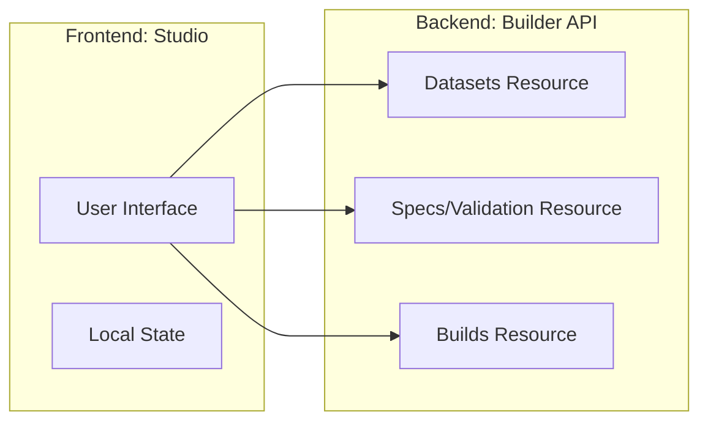
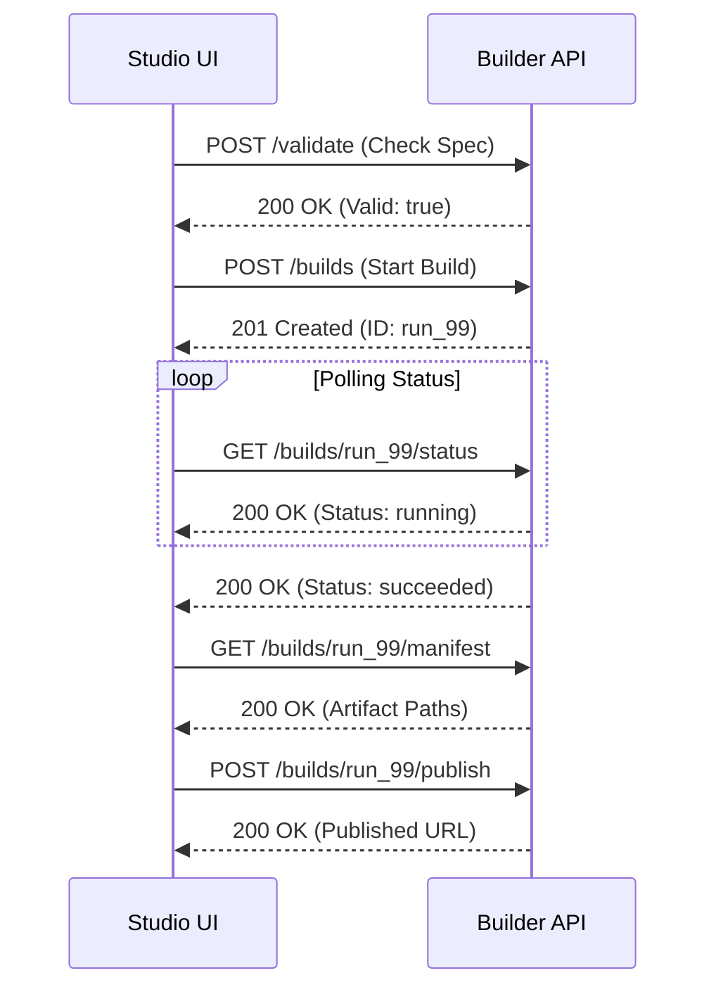

# API Contract — KPubData Studio

## 1. Overview
Studio(프론트엔드)가 Builder API(백엔드)와 대화할 때 사용하는 약속입니다. 모든 데이터는 JSON 형식으로 주고받습니다.



---

## 2. API Endpoints 상세

### [Datasets] 데이터 정보 조회

#### `GET /providers`
사용 가능한 데이터 제공 기관 목록을 가져옵니다.

**Request:** None
**Response Example:**
```json
[
  { "id": "datago", "name": "공공데이터포털" },
  { "id": "kma", "name": "기상청" }
]
```

---

### [Build Specs] 기획서 관리

#### `POST /validate`
현재 빌드 기획서(Build Spec)에 오류가 없는지 검사합니다.

**Request Example:**
```json
{
  "datasetId": "weather_report",
  "sources": [{ "provider": "kma", "dataset": "forecast", "params": { "region": "seoul" } }]
}
```

**Response Example (Success):**
```json
{ "valid": true, "errors": [] }
```

**Response Example (Error):**
```json
{ 
  "valid": false, 
  "errors": ["region 파라미터가 누락되었습니다."] 
}
```

---

### [Builds] 빌드 실행 및 상태

#### `POST /builds`
실제로 빌드 작업을 시작합니다.

**Request Body:** `BuildSpec` 객체
**Response Example:**
```json
{
  "id": "run_99",
  "status": "queued",
  "startedAt": "2024-04-05T10:00:00Z"
}
```

#### `GET /builds/:id/status`
진행 중인 빌드의 상태와 실시간 로그를 가져옵니다.

**Response Example:**
```json
{
  "id": "run_99",
  "status": "running",
  "logs": ["10:00:05 - 데이터 수집 중...", "10:00:08 - 50% 완료"]
}
```



---

## 3. TypeScript 타입 정의 (Type Mapping)

Studio의 코드(`src/lib/types.ts`)에서 사용하는 핵심 타입들입니다.

```typescript
// 빌드 기획서 (사용자가 입력한 내용)
export interface BuildSpec {
  datasetId: string;      // 데이터셋 고유 ID
  title: string;          // 제목
  sources: SourceRef[];   // 데이터 출처 목록
  exports: ExportTarget[];// 결과물 형식 (JSON, MD 등)
}

// 데이터 출처 정보
export interface SourceRef {
  provider: string;       // 제공 기관 (예: datago)
  dataset: string;        // 데이터셋 이름
  params: Record<string, string>; // 검색 조건
}

// 빌드 결과 요약 (빌드 완료 후 생성됨)
export interface BuildManifest {
  buildId: string;
  finishedAt: string;
  recordCount: number;    // 총 수집된 데이터 개수
  artifactPaths: string[];// 생성된 파일 경로들
}
```

---

## 4. 에러 응답 표준 (Error Format)
API 호출에 실패했을 때 서버가 보내주는 표준 에러 형식입니다.

```json
{
  "error": "BAD_REQUEST",
  "message": "지원하지 않는 파일 형식입니다.",
  "details": ["format must be one of: json, markdown, parquet"]
}
```

```mermaid
flowchart TD
    Request[Studio API Request] --> Status{HTTP Status?}
    Status -->|200/201| Success[성공 처리 / 데이터 UI 반영]
    Status -->|400| BadRequest[입력값 오류: BAD_REQUEST]
    Status -->|401/403| AuthError[인증 오류: AUTH_ERROR]
    Status -->|404| NotFound[데이터 없음: NOT_FOUND]
    Status -->|500| ServerError[서버 내부 오류: INTERNAL_ERROR]

    BadRequest --> ShowDetail[UI에 구체적 오류 사유 표시]
    AuthError --> LoginRedirect[로그인 화면으로 이동]
    NotFound --> EmptyState[데이터 없음 안내 UI]
    ServerError --> RetryToast[잠시 후 다시 시도 토스트 메시지]

---

## 📚 관련 문서

### 이 저장소 내 문서
| 문서 | 설명 |
| :--- | :--- |
| [ARCHITECTURE.md](./ARCHITECTURE.md) | 시스템 아키텍처 설계 |
| [STATE_MODEL.md](./STATE_MODEL.md) | 상태 관리 모델 |

### KPubData Product Family
| 저장소 | 문서 | 설명 |
| :--- | :--- | :--- |
| [kpubdata](https://github.com/yeongseon/kpubdata) | [API_SPEC.md](https://github.com/yeongseon/kpubdata/blob/main/API_SPEC.md) | Core API 명세 |
| [kpubdata-builder](https://github.com/yeongseon/kpubdata-builder) | [API_CONTRACT.md](https://github.com/yeongseon/kpubdata-builder/blob/master/API_CONTRACT.md) | Builder API 규약 |

```
