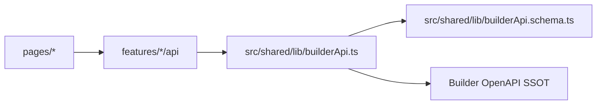

# API 규약 — KPubData Studio

## 1. 역할

Studio는 Builder HTTP API의 소비자입니다. HTTP wire 계약의 단일 소스는 Builder 저장소의 [contract/builder-api.yaml](https://github.com/yeongseon/kpubdata-builder/blob/main/contract/builder-api.yaml)입니다.

이 문서는 endpoint와 response body를 다시 적지 않고, Studio가 Builder 계약을 소비할 때 필요한 클라이언트 경계만 기록합니다.

- Builder endpoint/status/schema 변경은 Builder OpenAPI SSOT에서 시작합니다.
- Studio는 `src/shared/lib/builderApi.ts`와 `src/shared/lib/builderApi.schema.ts`에서 OpenAPI wire shape를 런타임 검증합니다.
- `MIN_BUILDER_API_VERSION`(SemVer 호환성 판정의 기준)과 지원 operation 집합은 `__tests__/contractConformance.test.ts`가 고정합니다.
- 사용자 화면은 page에서 직접 HTTP를 호출하지 않고 feature API를 통해 Builder를 사용합니다.

## 2. Studio 클라이언트 계층

```mermaid
graph LR
    Page[pages/*] --> Feature[features/*/api]
    Feature --> Client[src/shared/lib/builderApi.ts]
    Client --> Schema[src/shared/lib/builderApi.schema.ts]
    Client --> Builder[Builder OpenAPI SSOT]
```

| 계층 | 파일 | 책임 |
| :--- | :--- | :--- |
| 저수준 HTTP 클라이언트 | `src/shared/lib/builderApi.ts` | Builder URL, 인증 헤더, timeout/retry, `ApiError`, 최소 버전/SemVer 호환성 |
| wire schema | `src/shared/lib/builderApi.schema.ts` | Builder JSON 응답 Zod parse |
| BuildSpec 매핑 | `src/features/build-spec/specMapping.ts` | Studio camelCase model ↔ Builder snake_case spec |
| Preview API | `src/features/preview/api/index.ts` | `/preview` 응답을 UI용 rows/schema/warnings로 변환 |
| Validation API | `src/features/validation/api/index.ts` | Builder validation 결과를 폼 오류로 변환 |
| Runs API | `src/features/runs/api/index.ts` | build 실행과 run history 변환 |
| Artifacts API | `src/features/artifacts/api/index.ts` | artifact/manifest 조회 결과 변환 |

## 3. 계약 버전과 정합성

Studio는 `GET /version` 응답의 `api_version`을 `MIN_BUILDER_API_VERSION`과 **SemVer 호환성**
규칙(Builder ADR 0013)으로 비교해 설정 화면에 경고를 표시합니다. exact-equality 비교가
아닙니다.

호환성 규칙 (`isBuilderApiCompatible`):

1. `server major == required major` (major가 다르면 breaking — 비호환).
2. `server >= required` (같은 major 안에서 minor/patch가 최소값 이상).
3. 더 높은 additive minor/patch는 호환으로 간주합니다 (예: 최소값 1.18.0에 대해 Builder
   1.21.0은 호환).
4. 파싱 불가/형식 오류인 버전 문자열은 fail-closed로 비호환 처리합니다.

`MIN_BUILDER_API_VERSION`은 Studio의 현재 통합 표면(async build job + cooperative
cancel + manifest status/partial + provider credential + monitoring + publish)이 요구하는
**최소** Builder API 버전입니다. cancellation과 manifest status/partial이 Builder
1.18.0에서 도입됐고 Studio가 이 둘을 실제로 사용하므로 최소값은 `1.18.0`입니다.
1.19~1.21에 추가된 미사용 endpoint는 이 최소값에 반영하지 않으며 Studio에 구현하지도
않습니다.

정합성 규칙:

1. `MIN_BUILDER_API_VERSION`은 Studio가 실제로 호출·검토한 operation이 요구하는 최소
   버전만 가리킵니다.
2. Builder operation이 추가/삭제되면 Studio 클라이언트 구현과
   `contractConformance.test.ts`를 함께 갱신합니다.
3. 문서만 바꿔서 계약 drift를 덮지 않습니다.

## 4. BuildSpec 매핑 원칙

Studio UI model은 편집 편의상 camelCase를 사용하고, Builder는 YAML/snake_case BuildSpec을 받습니다.

| Studio 관심사 | Builder 관심사 | 원칙 |
| :--- | :--- | :--- |
| `datasetId` | `dataset_id` | 직렬화 경계에서만 변환 |
| `sources[].params` | JSON-compatible params | 문자열로 축소하지 않고 JSON 값을 보존 |
| `sources[].schema` | source schema contract | 편집 왕복에서 손실하지 않음 |
| `exports[].format` | exporter `kind` | Builder catalog/contract 밖의 open kind도 보존 |
| output path | `output_path` / metadata | 명시 경로 우선, 파생 경로는 충돌 없이 생성 |

Builder 데이터 수집/정규화 로직은 Studio에 재구현하지 않습니다. Studio는 기획서 작성, 검증 결과 표시, preview/render 상태 관리만 담당합니다.

## 5. Mock 모드

`VITE_USE_REAL_BUILDER=true`가 아니면 Studio feature API는 결정적 mock 결과를 반환합니다.

mock 정책:

- 화면 개발과 회귀 테스트가 Builder 서버 없이 동작해야 합니다.
- mock은 Builder 로직을 재구현하지 않고 UI 상태를 검증할 만큼의 고정 데이터만 제공합니다.
- 실연동 전용 wire shape는 Zod schema와 API tests로 고정합니다.
- mock/real 분기는 feature API 내부에 머물러야 하며 page 컴포넌트가 직접 환경변수를 해석하지 않습니다.

## 6. 오류 표시 원칙

Studio는 HTTP 실패와 정상 응답 안의 source-level 실패를 구분합니다.

| 상황 | Studio 처리 |
| :--- | :--- |
| 네트워크/인증/비정상 HTTP 실패 | `ApiError` 기반 오류 상태 표시 |
| `/preview` 전체 source 실패 | source key와 error를 포함한 preview 오류 표시 |
| `/preview` 일부 source 실패 | 성공 preview rows/schema와 함께 source warning 표시 |
| 정상 0-row preview | 빈 데이터 안내 표시 |
| `/build` source 실패 | `outcomes[]` 실패 이유를 사용자에게 표시 |

정상 0-row와 source/fetch 실패를 같은 empty state로 합치지 않습니다.

## 7. 관련 문서

| 문서 | 역할 |
| :--- | :--- |
| [Builder OpenAPI SSOT](https://github.com/yeongseon/kpubdata-builder/blob/main/contract/builder-api.yaml) | HTTP wire 계약 단일 소스 |
| [Builder API_CONTRACT.md](https://github.com/yeongseon/kpubdata-builder/blob/main/API_CONTRACT.md) | Builder 운영/정책 가이드 |
| [ARCHITECTURE.md](./ARCHITECTURE.md) | Studio 구조 |
| [STATE_MODEL.md](./STATE_MODEL.md) | UI 상태 흐름 |
| [USER_FLOWS.md](./USER_FLOWS.md) | 사용자 흐름 |
