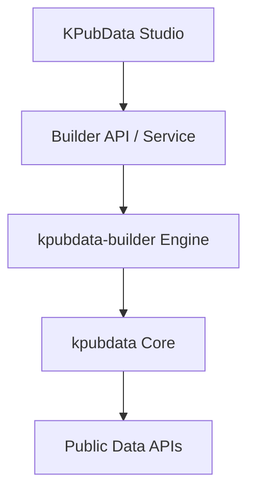
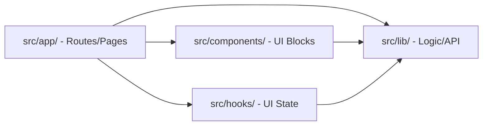
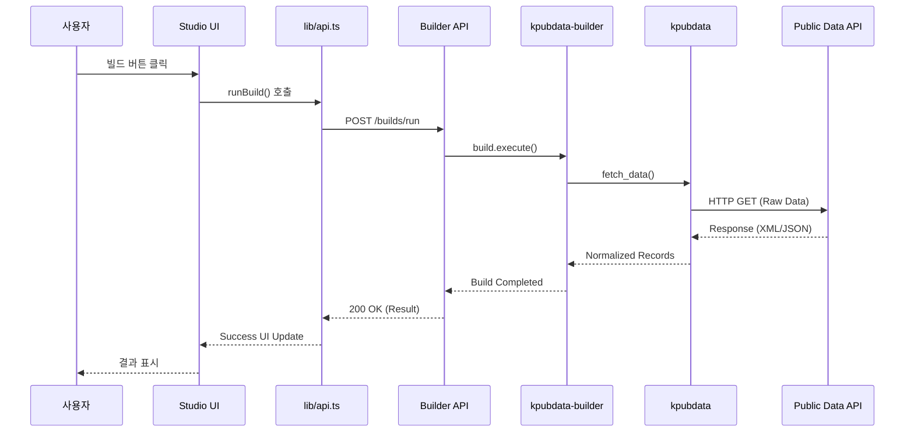
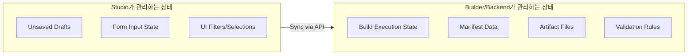

# Architecture — KPubData Studio

## 1. Role

Studio is the presentation and workflow layer above `kpubdata-builder`.



```text
kpubdata-studio
  -> builder API/service
  -> kpubdata-builder
  -> kpubdata
```

### "Studio가 뭔가요?" (초보자용 설명)
KPubData Studio는 복잡한 데이터 수집 과정을 누구나 쉽게 할 수 있도록 도와주는 **작업실**입니다.

- **비유**: "레스토랑 주문 시스템의 터치스크린 키오스크 같은 것입니다. 손님(사용자)이 메뉴(데이터셋)를 고르고, 옵션(파라미터)을 설정하고, 주문(빌드)하면, 주방(Builder)이 요리(아티팩트)를 만듭니다."
- **역할**: 개발자가 아닌 사람도 마우스 클릭 몇 번으로 공공데이터를 수집하고, 정제하고, 파일로 내려받을 수 있는 환경을 제공합니다.

---

## 2. Next.js + React 기초 (대학생을 위한 개념 정리)

Studio는 최신 웹 기술인 **Next.js**와 **React**로 만들어졌습니다. 처음 접하는 분들을 위한 핵심 개념입니다:

- **React**: UI(사용자 화면)를 조각(컴포넌트)으로 나누어 만드는 도구입니다. 레고 블록을 조립하듯 화면을 만듭니다.
- **Next.js App Router**: URL 주소와 실제 페이지 파일을 연결해주는 내비게이션 시스템입니다.
- **page.tsx**: 특정 URL 주소에 들어갔을 때 실제로 보이는 화면 내용이 담긴 파일입니다.
- **layout.tsx**: 여러 페이지에서 공통으로 쓰는 틀(헤더, 사이드바 등)을 정의하는 파일입니다.
- **Server Components**: 서버에서 미리 그려서 보내주는 화면 조각 (빠른 로딩).
- **Client Components**: 사용자의 클릭이나 입력에 즉각 반응하는 화면 조각 (상호작용). 파일 맨 위에 `'use client'`라고 적혀 있습니다.

---

## 3. Architectural Principle

Studio does not own build semantics.
It renders configuration, previews, statuses, and outputs.

---

## 4. Frontend Architecture 상세

Studio의 코드는 체계적으로 나누어져 관리됩니다. 각 폴더의 역할은 다음과 같습니다.



### 디렉토리 구조 및 가이드

- **`src/app/`**: 페이지 경로와 레이아웃을 정의합니다. (URL 구조 담당)
  - `page.tsx`: `/` 경로 (홈 대시보드)
  - `builds/page.tsx`: `/builds` 경로 (빌드 목록)
  - `builds/new/page.tsx`: `/builds/new` 경로 (새 빌드 생성)
- **`src/components/`**: 재사용 가능한 UI 조각들을 모아둡니다.
  - `ui/`: 버튼, 입력창 등 기본 디자인 요소
  - `editor/`: 빌드 설정 편집기 관련 컴포넌트
- **`src/lib/`**: 비즈니스 로직, API 호출 함수, 타입 정의가 들어갑니다.
  - `api.ts`: 백엔드 서버와 통신하는 함수들
  - `types.ts`: 데이터 구조를 정의한 타입들
- **`src/hooks/`**: 반복되는 상태 관리 로직을 추출한 '커스텀 훅'들을 둡니다.

---

## 5. Builder API와의 통신

Studio는 직접 데이터를 수집하지 않고, **Builder API**라는 중간 매개체를 통해 일을 시킵니다.



### 데이터 흐름 (Flow)
`Studio (UI)` ↔ `Builder API` ↔ `kpubdata-builder (엔진)` ↔ `kpubdata (데이터 소스)`

### `lib/api.ts`의 역할
이 파일은 Studio가 Builder API에게 "이 빌드 설정이 괜찮은지 봐줘", "빌드를 시작해줘"라고 부탁할 때 사용하는 함수들의 집합입니다.

**API 호출 예시:**
```typescript
// 빌드 설정 검증 요청
const result = await validateSpec(mySpec);

// 빌드 결과 미리보기 요청
const preview = await previewBuild(mySpec);
```

---

## 6. Major Frontend Areas

- build dashboard
- source selection
- build spec editor
- preview panel
- validation panel
- run/build history
- artifact viewer
- publication form

## 4. Backend / Integration Surface

Studio needs a stable integration layer exposing:
- list datasets
- fetch source preview
- validate spec
- execute build
- fetch build status
- read manifest
- list artifacts
- publish build

## 5. State Ownership



### Studio owns
- unsaved form state
- local wizard state
- UI filters and selections

### Builder/backend owns
- build execution state
- manifest data
- artifact file state
- validation semantics

---

## 📚 관련 문서

### 이 저장소 내 문서
| 문서 | 설명 |
| :--- | :--- |
| [STATE_MODEL.md](./STATE_MODEL.md) | 상태 관리 및 전이 모델 |
| [UI_SPEC.md](./UI_SPEC.md) | UI 컴포넌트 규격 |
| [USER_FLOWS.md](./USER_FLOWS.md) | 사용자 시나리오 및 흐름 |
| [INFORMATION_ARCHITECTURE.md](./INFORMATION_ARCHITECTURE.md) | 정보 및 메뉴 구조 |
| [API_CONTRACT.md](./API_CONTRACT.md) | API 통신 규약 |

### KPubData Product Family
| 저장소 | 문서 | 설명 |
| :--- | :--- | :--- |
| **전체 제품군** | [product-family-architecture.md](https://github.com/yeongseon/kpubdata/blob/main/docs/product-family-architecture.md) | **3개 저장소 전체 시스템 아키텍처** |
| [kpubdata](https://github.com/yeongseon/kpubdata) | [ARCHITECTURE.md](https://github.com/yeongseon/kpubdata/blob/main/ARCHITECTURE.md) | Core 아키텍처 |
| [kpubdata-builder](https://github.com/yeongseon/kpubdata-builder) | [ARCHITECTURE.md](https://github.com/yeongseon/kpubdata-builder/blob/main/ARCHITECTURE.md) | Builder 아키텍처 |

