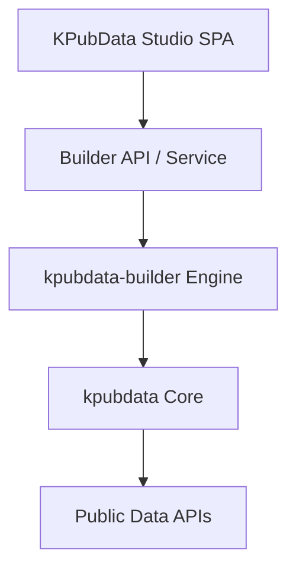
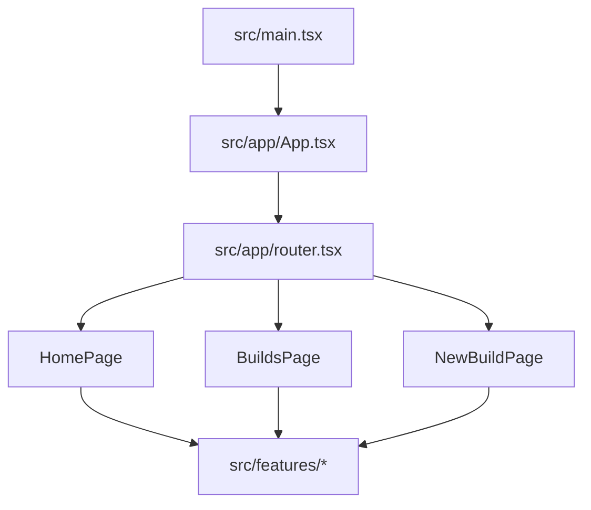
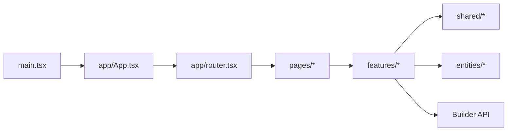
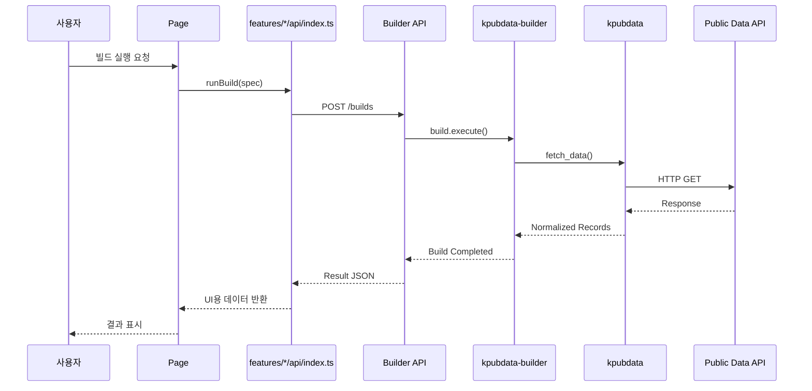
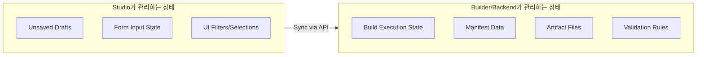

# Architecture — KPubData Studio

## 1. Role

Studio is the presentation and workflow layer above `kpubdata-builder`.



```text
kpubdata-studio
  -> builder API/service
  -> kpubdata-builder
  -> kpubdata
```

### "Studio가 뭔가요?" (초보자용 설명)
KPubData Studio는 복잡한 데이터 수집 과정을 누구나 쉽게 할 수 있도록 도와주는 **작업실**입니다.

- **비유**: "레스토랑 주문 시스템의 터치스크린 키오스크 같은 것입니다. 손님(사용자)이 메뉴(데이터셋)를 고르고, 옵션(파라미터)을 설정하고, 주문(빌드)하면, 주방(Builder)이 요리(아티팩트)를 만듭니다."
- **역할**: 개발자가 아닌 사람도 마우스 클릭 몇 번으로 공공데이터를 수집하고, 정제하고, 파일로 내려받을 수 있는 환경을 제공합니다.

---

## 2. SPA 아키텍처 개요

Studio는 **Vite + React + TypeScript + React Router** 기반의 단일 페이지 애플리케이션(SPA)입니다.

- **Vite**: 빠른 개발 서버와 프로덕션 빌드를 담당합니다.
- **React**: 화면을 컴포넌트 단위로 조립합니다.
- **React Router**: 브라우저 URL과 페이지 컴포넌트를 연결합니다.
- **TanStack Query**: Builder API 응답을 서버 상태로 캐싱하고 동기화합니다.
- **Zustand**: 편집기 임시 저장과 UI 세션 상태를 다루는 경량 스토어입니다.
- **TypeScript**: Builder API 계약과 UI 상태를 정적으로 검증합니다.



---

## 3. Architectural Principle

Studio does not own build semantics.
It renders configuration, previews, statuses, and outputs.

핵심 원칙:
- 빌드 의미론은 Builder가 소유한다.
- Studio는 입력, 상태 전이, 시각화, 검토 흐름을 담당한다.
- 기능별 API 호출은 feature 경계 안에 둔다.
- 공통 타입과 UI는 `shared/`, 핵심 도메인 표현은 `entities/`에 둔다.

---

## 4. Frontend Architecture 상세



### 디렉토리 구조 및 가이드

- **`src/main.tsx`**: 브라우저 `#root`에 앱을 마운트하는 진입점입니다.
- **`src/app/`**: 앱 셸과 라우터를 조립합니다.
  - `App.tsx`: `RouterProvider` 연결
  - `router.tsx`: 브라우저 라우트와 공통 셸 정의
- **`src/pages/`**: URL 단위 페이지 컴포넌트를 둡니다.
  - `HomePage.tsx`: `/`
  - `BuildsPage.tsx`: `/builds`
  - `NewBuildPage.tsx`: `/builds/new`
- **`src/features/`**: 기능 단위로 UI, API, 상태를 묶습니다.
  - `build-spec/`: 빌드 기획 입력
  - `preview/`: 미리보기
  - `validation/`: 검증 결과
  - `runs/`: 실행 추적
  - `artifacts/`: 결과물 조회
  - `publish/`: 출판 흐름
- **`src/shared/`**: 공통 config, hooks, lib, types, ui를 둡니다.
- **`src/entities/`**: `build`, `dataset`, `manifest`, `artifact` 등 핵심 도메인 모델을 둡니다.

### Feature Folder Convention

기능 폴더는 아래 패턴을 기본으로 삼습니다.

```text
src/features/<feature>/
├── api/           # Builder API 호출 진입점
├── components/    # 기능 전용 UI
├── hooks/         # 기능 전용 상태/데이터 훅 (필요 시)
└── schemas/       # 입력 검증/매핑 스키마 (필요 시)
```

원칙:
- 기능별 HTTP 연동은 `features/*/api/index.ts`에서 시작합니다.
- 페이지는 여러 feature를 조립하지만 Builder API 세부 구현을 직접 소유하지 않습니다.
- feature 간 공통 코드는 `shared/`로 올리고, 개념적으로 독립된 핵심 데이터는 `entities/`에 둡니다.

---

## 5. Builder API와의 통신

Studio는 직접 데이터를 수집하지 않고, **Builder API**라는 중간 매개체를 통해 일을 시킵니다.



### 데이터 흐름 (Flow)
`Studio (SPA)` ↔ `Builder API` ↔ `kpubdata-builder (엔진)` ↔ `kpubdata (데이터 소스)`

### API Client Positioning

- Builder API 클라이언트는 Studio 내부의 **integration surface**입니다.
- 페이지는 feature API를 호출하고, feature API는 Builder의 HTTP 계약을 캡슐화합니다.
- 필드명 변환, 응답 정규화, 에러 표준화는 feature API 또는 shared lib에서 담당합니다.

---

## 6. Major Frontend Areas

- build dashboard
- source selection
- build spec editor
- preview panel
- validation panel
- run/build history
- artifact viewer
- publication form

## 7. Backend / Integration Surface

Studio needs a stable integration layer exposing:
- list datasets
- fetch source preview
- validate spec
- execute build
- fetch build status
- read manifest
- list artifacts
- publish build

## 8. State Ownership



### Studio owns
- unsaved form/draft state
- local wizard state
- UI filters, selections, and panel state

### State ownership rule
- Zustand owns UI and draft state.
- TanStack Query owns server state and caching.

### Builder/backend owns
- build execution state
- manifest data
- artifact file state
- validation semantics

---

## 관련 문서

### 이 저장소 내 문서
| 문서 | 설명 |
| :--- | :--- |
| [STATE_MODEL.md](./STATE_MODEL.md) | 상태 관리 및 전이 모델 |
| [UI_SPEC.md](./UI_SPEC.md) | UI 컴포넌트 규격 |
| [USER_FLOWS.md](./USER_FLOWS.md) | 사용자 시나리오 및 흐름 |
| [INFORMATION_ARCHITECTURE.md](./INFORMATION_ARCHITECTURE.md) | 정보 및 메뉴 구조 |
| [API_CONTRACT.md](./API_CONTRACT.md) | API 통신 규약 |

### KPubData Product Family
| 저장소 | 문서 | 설명 |
| :--- | :--- | :--- |
| **전체 제품군** | [product-family-architecture.md](https://github.com/yeongseon/kpubdata/blob/main/docs/product-family-architecture.md) | **3개 저장소 전체 시스템 아키텍처** |
| [kpubdata](https://github.com/yeongseon/kpubdata) | [ARCHITECTURE.md](https://github.com/yeongseon/kpubdata/blob/main/ARCHITECTURE.md) | Core 아키텍처 |
| [kpubdata-builder](https://github.com/yeongseon/kpubdata-builder) | [ARCHITECTURE.md](https://github.com/yeongseon/kpubdata-builder/blob/main/ARCHITECTURE.md) | Builder 아키텍처 |
