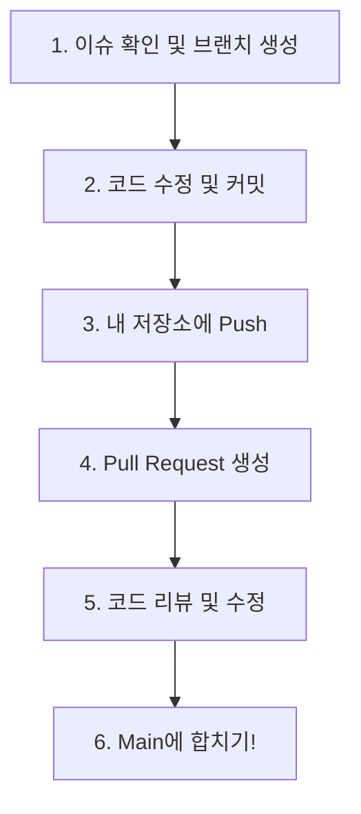

# KPubData-Studio 기여 가이드 (CONTRIBUTING.md)

KPubData-Studio 프로젝트에 오신 것을 환영합니다! 이 프로젝트는 공공데이터를 시각화하고 관리하기 위한 웹 대시보드입니다. Next.js와 TypeScript를 사용해 멋진 화면을 만들어 보세요.

## 1. 환영 인사 및 프로젝트 소개

KPubData 패밀리 소개:
- **kpubdata**: 데이터 수집 엔진 (Python)
- **kpubdata-builder**: 데이터 가공 도구 (Python)
- **kpubdata-studio**: 데이터 시각화 및 웹 관리 도구 (Next.js)

이 레포지토리(`kpubdata-studio`)는 사용자에게 데이터를 보여주는 웹 애플리케이션입니다.

## 2. 개발 환경 설정 (처음부터 끝까지)

이 프로젝트는 **Next.js**와 **TypeScript**로 만들어졌습니다. 개발을 시작하기 위해 컴퓨터에 다음 도구들을 설치해야 합니다.

### Step 1: 필수 도구 설치
1. **Git**: 코드의 버전을 관리하는 도구입니다. ([다운로드](https://git-scm.com))
   - 설치 확인: 터미널에 `git --version` 입력
2. **Node.js 20+**: 웹 서버를 실행하는 엔진입니다. ([다운로드](https://nodejs.org))
   - 설치 확인: 터미널에 `node --version` 입력
3. **GitHub 계정**: 코드를 올릴 저장소 계정이 필요합니다.
   - [SSH 키 설정](https://docs.github.com/ko/authentication/connecting-to-github-with-ssh)을 해두면 매번 로그인할 필요가 없어 편리합니다.

### Step 2: Fork & Clone
이 저장소를 여러분의 개인 저장소로 복사(Fork)한 뒤, 내 컴퓨터로 내려받습니다.

```bash
# 1. 내 GitHub로 Fork한 저장소를 내 컴퓨터로 가져오기 (YOUR_USERNAME 부분을 본인 아이디로 수정)
git clone https://github.com/YOUR_USERNAME/kpubdata-studio.git
cd kpubdata-studio

# 2. 원본 저장소(Upstream) 연결하기 (나중에 최신 코드를 받아오기 위해 필요합니다)
git remote add upstream https://github.com/yeongseon/kpubdata-studio.git
```

### Step 3: 개발 환경 구축
내려받은 폴더 안에서 다음 명령어를 순서대로 입력하세요.

```bash
# 필요한 라이브러리 모두 설치
npm install

# 내 컴퓨터에서 웹사이트 실행하기
npm run dev
# 실행 후 브라우저에서 http://localhost:3000 에 접속해 보세요!

# 코드 스타일 확인 (규칙에 맞게 짰는지 검사)
npm run lint

# 타입 체크 (데이터 형식이 올바른지 검사)
npx tsc --noEmit
```

## 3. 브랜치 전략과 협업 규칙

프로젝트는 여러 명이 함께 만듭니다. 서로의 작업을 방해하지 않기 위해 몇 가지 약속을 지킵니다. **"규칙은 적지만, 반드시 지킵니다. 모르면 언제든 물어보세요!"**

### 3-1. 브랜치란? (비유)
브랜치는 **"나만의 작업 연습장"**입니다. 원본(main)을 그대로 둔 채, 연습장에서 마음껏 코드를 고치고 테스트한 뒤, 완벽해졌을 때 원본에 합칩니다.

### 3-2. 브랜치 전략
우리는 `main` 브랜치에 직접 코드를 올리지 않습니다. 반드시 기능별 브랜치를 만들어 작업합니다.

```mermaid
gitgraph
    commit id: "initial"
    branch feat/issue-5-dashboard-page
    checkout feat/issue-5-dashboard-page
    commit id: "feat: add dashboard layout"
    commit id: "feat: add chart component"
    checkout main
    merge feat/issue-5-dashboard-page id: "PR #5 merged"
```

### 3-3. 브랜치 이름 규칙
작업의 종류와 관련된 이슈 번호를 포함해 이름을 짓습니다.

| 종류 | 용도 | 이름 예시 |
| :--- | :--- | :--- |
| **feat** | 새로운 기능 추가 | `feat/issue-5-add-dashboard` |
| **fix** | 버그 수정 | `fix/issue-8-fix-layout` |
| **docs** | 문서 수정 | `docs/update-readme` |

### 3-4. 전체 작업 흐름
코드를 수정해서 서버에 반영되기까지의 과정입니다.



**상세 명령어 순서:**
1. **최신 코드 가져오기**: `git checkout main && git pull upstream main`
2. **새 브랜치 만들기**: `git checkout -b feat/issue-번호-기능이름`
3. **코드 수정 후 저장**: `git add .`
4. **커밋(기록)**: `git commit -m "feat: 대시보드 페이지 추가"`
5. **서버에 올리기**: `git push origin feat/issue-번호-기능이름`
6. **PR 생성**: GitHub 웹사이트에서 `Compare & pull request` 버튼 클릭

### 3-5. 커밋 메시지 규칙
기록은 **영문**으로 작성하며, 첫 단어는 다음 중 하나를 선택합니다.

| 타입 | 의미 |
| :--- | :--- |
| **feat** | 새로운 기능 추가 |
| **fix** | 버그 수정 |
| **docs** | 문서(README 등) 수정 |
| **test** | 테스트 코드 추가 |
| **refactor** | 코드 개선 (기능 변화 없음) |
| **style** | 코드 포맷팅 (세미콜론 누락 등) |

### 3-6. 절대 금지 사항
- **`main` 브랜치에 직접 Push 금지**: 모든 변경 사항은 PR을 통해서만 반영됩니다.
- **Force Push (`-f`) 금지**: 다른 사람의 작업을 지워버릴 수 있어 매우 위험합니다.
- **남의 브랜치 수정 금지**: 다른 사람이 작업 중인 브랜치를 지우거나 이름을 바꾸지 마세요.
- **추측하지 마세요**: 모르는 명령어나 오류가 발생하면 **반드시** 먼저 물어보세요.

### 3-7. PR 올리기 전 체크리스트
Pull Request를 올리기 전, 터미널에서 다음 세 가지를 실행해 오류가 없는지 확인하세요.

```bash
npm run lint       # 1. 문법 규칙 검사
npx tsc --noEmit   # 2. 타입 오류 검사
npm test           # 3. 자동화 테스트 검사
```

## 4. 코딩 규칙 (Coding Convention)

- **TypeScript**: 모든 데이터와 컴포넌트에는 타입이 있어야 합니다. `any` 타입은 금지입니다.
- **함수형 컴포넌트**: 모든 UI 컴포넌트는 함수형(`function`)으로 작성해 주세요.
- **Tailwind CSS**: 디자인은 Tailwind CSS를 기본으로 사용합니다.

## 5. 첫 번째 페이지 추가하기 (Next.js App Router)

Next.js 15의 App Router 방식을 사용합니다.

1. `src/app/` 폴더 아래에 새로운 폴더를 만듭니다 (예: `src/app/dashboard/`).
2. 해당 폴더 안에 `page.tsx` 파일을 만듭니다.
3. React 컴포넌트를 작성하고 `export default`로 내보냅니다.
4. 브라우저에서 `http://localhost:3000/dashboard` 주소로 접속해 확인합니다.

## 6. PR 가이드 및 체크리스트

PR 제목은 `[#이슈번호] 간단한 설명` 형식을 지켜주세요.

**보내기 전 체크리스트:**
- [ ] `npm run lint` 결과가 깨끗한가요?
- [ ] `npx tsc --noEmit`에서 타입 오류가 없나요?
- [ ] `npm test`가 모두 통과하나요?

## 7. 도움 요청하기

잘 안 되는 것이나 궁금한 점이 있다면 언제든지 GitHub Issues에 남겨주세요! 모르는 것이 생기는 것은 당연합니다. 질문을 통해 지식을 나누는 것도 멋진 기여입니다. 함께 공부하며 만들어 가요!

---

## 관련 문서

### 이 저장소 내 문서
| 문서 | 설명 |
| :--- | :--- |
| [AGENTS.md](./AGENTS.md) | 에이전트 협업 가이드 |
| [ARCHITECTURE.md](./ARCHITECTURE.md) | 시스템 아키텍처 설계 |
| [ROADMAP.md](./ROADMAP.md) | 개발 로드맵 |

### KPubData Product Family
| 저장소 | 문서 | 설명 |
| :--- | :--- | :--- |
| [kpubdata](https://github.com/yeongseon/kpubdata) | [CONTRIBUTING.md](https://github.com/yeongseon/kpubdata/blob/main/CONTRIBUTING.md) | Core 기여 가이드 |
| [kpubdata-builder](https://github.com/yeongseon/kpubdata-builder) | [CONTRIBUTING.md](https://github.com/yeongseon/kpubdata-builder/blob/main/CONTRIBUTING.md) | Builder 기여 가이드 |
