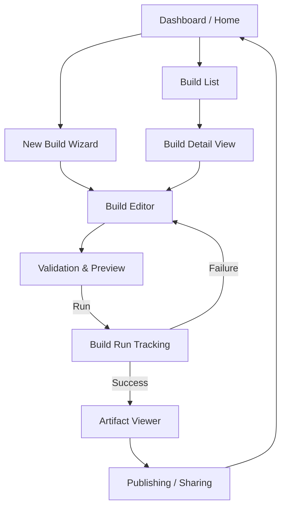
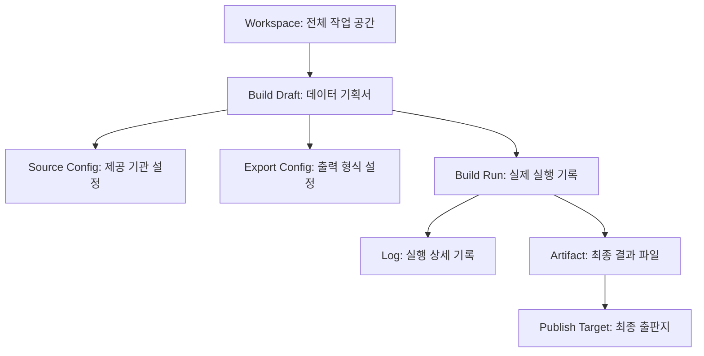

# Information Architecture — KPubData Studio

## 1. Top-level Sections (주요 메뉴 구성)

Studio의 모든 정보는 사용자의 작업 흐름에 따라 다음 6가지 핵심 섹션으로 나뉩니다.

- **Home (홈)**: 전체 요약 대시보드. 최근 작업한 빌드와 현재 진행 중인 상태를 보여줍니다.
- **Builds (빌드 관리)**: 지금까지 만든 모든 빌드 기획서와 실행 결과를 모아보는 곳입니다.
- **New Build (새 빌드 생성)**: 새로운 데이터 수집을 시작하는 입구입니다.
- **Preview & Validation (미리보기 및 검증)**: 빌드 실행 전, 데이터 모양을 확인하고 설정 오류를 잡는 중간 단계입니다.
- **Artifacts (결과물 관리)**: 빌드 성공 후 만들어진 데이터 파일(Markdown, JSONL 등)을 열람하고 다운로드하는 곳입니다.
- **Publish (출판)**: 검토가 끝난 데이터를 외부로 공유하거나 정식 출판하는 최종 관문입니다.

---

## 2. Navigation Flow Diagram (사용자 이동 경로)

사용자가 Studio에서 정보를 찾아가는 흐름입니다.



```text
[Dashboard] 
    |
    +--> [Build List] --(선택)--> [Build Detail]
    |                                |
    +--> [Create New Build] -------->+--> [Editor] --(검증)--> [Preview]
                                                                  |
                                                               (실행)
                                                                  |
                                     [Artifacts] <---(완료)--- [Run Tracking]
                                         |
                                         +--(선택)--> [Publishing]
```

---

## 3. URL Structure (웹 주소 구조)

각 화면에 해당하는 브라우저 주소(URL)입니다. 직관적인 구조로 설계되었습니다.

```mermaid
graph LR
    Root[/] --> Dashboard[page.tsx]
    Root --> Builds[/builds]
    Root --> Settings[/settings]

    Builds --> BuildList[page.tsx]
    Builds --> New[/new/page.tsx]
    Builds --> BuildID[/[id]/page.tsx]
    
    BuildID --> Run[/run/page.tsx]
```

| 경로 | 화면 내용 | 폴더 위치 |
| :--- | :--- | :--- |
| `/` | 대시보드 홈 (최근 빌드 5개 표시) | `src/app/page.tsx` |
| `/builds` | 전체 빌드 목록 (검색 및 필터링 가능) | `src/app/builds/page.tsx` |
| `/builds/new` | 새 빌드 생성 마법사 (빈 문서) | `src/app/builds/new/page.tsx` |
| `/builds/[id]` | 특정 빌드의 상세 정보 및 설정 편집 | `src/app/builds/[id]/page.tsx` |
| `/builds/[id]/run` | 실행 중인 빌드의 실시간 추적 화면 | `src/app/builds/[id]/run/page.tsx` |
| `/settings` | 계정 설정 및 API 연동 설정 | `src/app/settings/page.tsx` |

---

## 4. Object Hierarchy (정보의 계층 구조)

Studio 안에서 다루는 모든 정보는 다음과 같은 상하 관계를 가집니다.



- **Workspace (작업실)**: 사용자의 전체 작업 공간
  - **Build Draft (빌드 기획서)**: 데이터 수집 설정 (수정 가능)
    - **Source Config (소스 설정)**: 어떤 기관의 데이터를 가져올지 (기상청, 서울시 등)
    - **Export Config (출력 설정)**: 어떤 파일로 만들지 (Markdown, CSV 등)
  - **Build Run (실행 기록)**: 기획서를 바탕으로 실제로 실행한 결과 (수정 불가)
    - **Log (기록)**: 실행 과정에서 발생한 사건들
    - **Artifact (결과 파일)**: 최종적으로 생성된 데이터 뭉치
  - **Publish Target (출판지)**: 결과물이 최종적으로 도달할 곳 (로컬 파일, 클라우드 등)

---

## 관련 문서

### 이 저장소 내 문서
| 문서 | 설명 |
| :--- | :--- |
| [UI_SPEC.md](./UI_SPEC.md) | UI 컴포넌트 및 화면 명세 |
| [USER_FLOWS.md](./USER_FLOWS.md) | 사용자 시나리오 및 흐름 |
| [ARCHITECTURE.md](./ARCHITECTURE.md) | 시스템 아키텍처 설계 |
| [STATE_MODEL.md](./STATE_MODEL.md) | 상태 관리 모델 |

### KPubData Product Family
| 저장소 | 문서 | 설명 |
| :--- | :--- | :--- |
| [kpubdata](https://github.com/yeongseon/kpubdata) | [ARCHITECTURE.md](https://github.com/yeongseon/kpubdata/blob/main/ARCHITECTURE.md) | Core 아키텍처 |
| [kpubdata-builder](https://github.com/yeongseon/kpubdata-builder) | [ARCHITECTURE.md](https://github.com/yeongseon/kpubdata-builder/blob/main/ARCHITECTURE.md) | Builder 아키텍처 |
