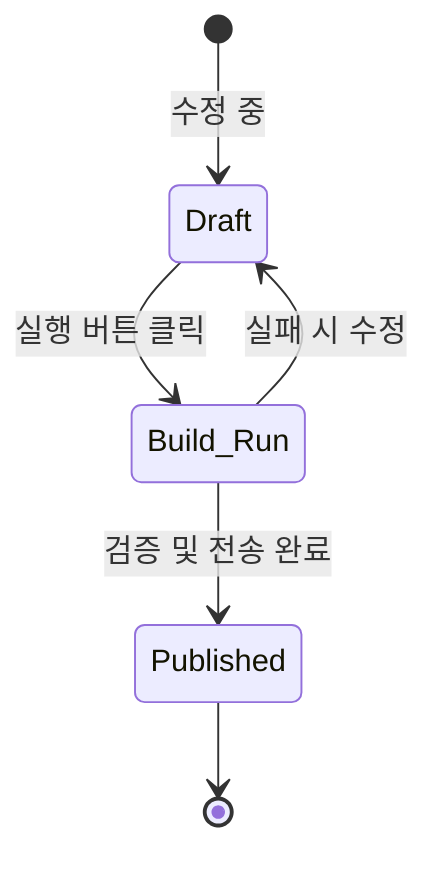
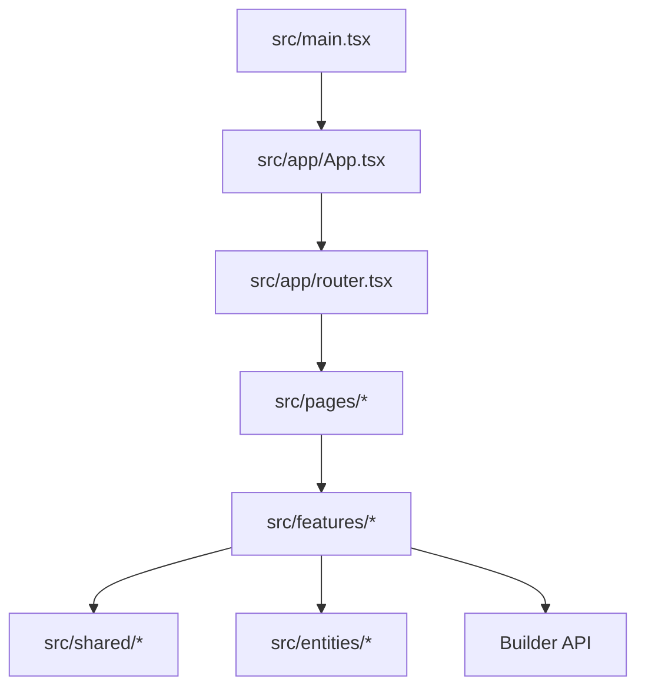
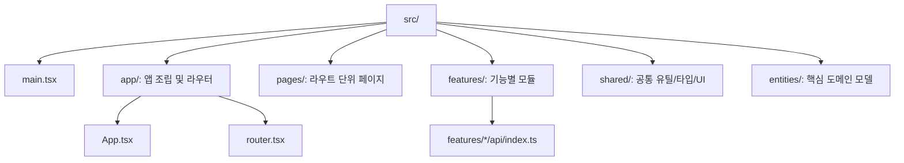

# KPubData Studio — Korea Public Data Studio

[](https://vite.dev/)
[](https://www.typescriptlang.org/)
[](LICENSE)

**KPubData Studio (Korea Public Data Studio)**는 KPubData 제품군의 시각적 인터페이스(UI — 사용자가 보고 조작하는 화면)입니다.

이 프로젝트는 사용자가 복잡한 설정 파일을 직접 수정하지 않고도 한국 공공데이터 빌드 과정을 기획, 미리보기, 실행 및 검사할 수 있도록 돕는 웹 기반 작업실입니다.

---

## 소개

KPubData Studio는 `kpubdata-builder` 출판사에서 만드는 **책(데이터셋)을 기획하고 미리보는 작업실**과 같습니다. 코딩 없이 버튼 몇 번으로 어떤 데이터를 가져올지 정하고, 결과가 어떻게 나올지 눈으로 확인하며 최종 출판까지 관리하는 웹 화면입니다.

KPubData Studio는 데이터셋을 설계·미리보기·실행하는 dataset workbench UI입니다.

## 이 프로젝트가 존재하는 이유

한국 공공데이터를 다루는 과정은 종종 복잡하고 기술적인 진입장벽이 존재합니다.
- **YAML 편집의 어려움**: [YAML](https://ko.wikipedia.org/wiki/YAML)은 들여쓰기로 구조를 표현하는 텍스트 설정 파일인데, 빈칸 하나만 잘못 넣어도 오류가 나서 직접 수정하기 어렵습니다.
- **시각적 피드백의 부재**: 데이터를 실제로 빌드하기 전에 결과물이 어떻게 보일지 미리 확인하는 기능이 중요합니다.
- **비개발자 접근성**: 코딩 경험이 없는 사용자나 기획자도 공공데이터 처리 과정을 손쉽게 구성하고 관리할 수 있어야 합니다.

## 핵심 개념

| 용어 | 설명 |
| :--- | :--- |
| **Draft** | 아직 저장되지 않은 임시 기획 상태 (편집 중) |
| **Build Run** | 실제로 빌드를 돌려 데이터를 가져오는 과정 |
| **Preview** | 빌드 결과물을 미리 눈으로 확인하는 화면 |
| **State Model** | 기획(Draft)부터 실행(Run), 출판(Publish)까지의 상태 흐름도 |
| **Studio Shell** | 전체 웹 화면을 구성하는 기본 틀과 내비게이션 |
| **UI Spec** | 화면의 각 요소가 어떻게 보이고 반응해야 하는지에 대한 약속 |

## 상태 모델 (State Model)

사용자가 작업을 시작하면 데이터는 다음 순서로 상태가 변합니다:



- **Draft**: 사용자가 내용을 고치고 있는 상태입니다. (수정 중)
- **Build Run**: '실행' 버튼을 눌러 실제로 데이터를 모으는 중입니다.
- **Published**: 모든 검증을 마치고 결과물이 공유된 상태입니다.

## 기술 스택

| 기술 | 버전 | 설명 |
| :--- | :--- | :--- |
| **[Vite](https://vite.dev/)** | 8 | 빠른 개발 서버와 번들링을 제공하는 프런트엔드 빌드 도구 |
| **[React](https://ko.react.dev/)** | 19 | 화면을 작은 조각(컴포넌트)으로 나누어 만드는 UI 라이브러리 |
| **[React Router](https://reactrouter.com/)** | 7 | 브라우저에서 클라이언트 사이드 라우팅을 담당하는 내비게이션 라이브러리 |
| **[TanStack Query](https://tanstack.com/query)** | 5 | 서버 상태를 관리하고 Builder API 데이터를 가져오며 캐싱하는 데이터 패칭 라이브러리 |
| **[Zustand](https://zustand-demo.pmnd.rs/)** | 5 | 경량 전역/로컬 UI 상태를 관리하는 스토어로, 편집기 임시 저장과 UI 세션 상태에 사용 |
| **[TypeScript](https://www.typescriptlang.org/ko/docs/)** | 5 | 자바스크립트에 타입(자료형)을 추가하여 실수를 줄여주는 언어 |
| **[Tailwind CSS](https://tailwindcss.com/docs)** | 4 | HTML에 직접 디자인 클래스를 적용하는 스타일링 도구 |

## 설치 및 실행 방법

개발 환경을 설정하려면 [npm](https://docs.npmjs.com/about-npm)(Node.js 패키지 관리 도구)을 사용하여 다음 명령어를 실행하세요:

```bash
git clone https://github.com/yeongseon/kpubdata-studio.git
cd kpubdata-studio
npm install
npm run dev
```

`npm run dev`는 Vite 개발 서버를 실행합니다. 그 후 브라우저에서 [http://localhost:5173](http://localhost:5173)을 엽니다.

## 주요 기능 소개

- **빌드 기획서 작성**: 화면에서 클릭과 입력만으로 데이터셋 빌드 규칙을 간편하게 설정합니다.
- **실시간 미리보기**: 설정한 규칙에 따라 데이터가 어떤 모습으로 정리될지 즉시 확인합니다.
- **빌드 실행 및 모니터링**: `kpubdata-builder`와 연동하여 실제 데이터 수집 과정을 실시간으로 추적합니다.
- **결과물 검사**: 생성된 데이터 파일의 구조와 내용을 눈으로 확인하고 검사합니다.

## 애플리케이션 실행 흐름



```text
src/main.tsx -> src/app/App.tsx -> src/app/router.tsx -> src/pages/* -> src/features/* -> Builder API
```

## 파일 구조 가이드



```text
src/
├── main.tsx                    # Vite 엔트리 포인트
├── app/
│   ├── App.tsx                # RouterProvider 연결
│   └── router.tsx             # React Router 설정 및 App Shell
├── pages/                     # 라우트 단위 페이지 컴포넌트
├── features/                  # 기능별 UI/API/상태 모듈
│   └── */api/index.ts         # 기능별 Builder API 연동 진입점
├── shared/                    # 공통 config, hooks, lib, types, ui
└── entities/                  # build, dataset, manifest, artifact 도메인 모델
```

## 개발 스크립트

| 스크립트 | 설명 |
| :--- | :--- |
| `npm run dev` | Vite 개발 서버 실행 |
| `npm run lint` | ESLint 검사 |
| `npm test` | Vitest 테스트 실행 |
| `npm run build` | Vite 프로덕션 빌드 |
| `npm run preview` | 빌드 결과 로컬 프리뷰 |

---

## 문서 가이드 (Document Guide)

### 핵심 설계
| 문서 | 설명 |
| :--- | :--- |
| [ARCHITECTURE.md](./ARCHITECTURE.md) | Studio 시스템 아키텍처 및 설계 원칙 |
| [STATE_MODEL.md](./STATE_MODEL.md) | 빌드 상태 전이 및 UI 상태 관리 모델 |
| [UI_SPEC.md](./UI_SPEC.md) | 사용자 인터페이스 컴포넌트 및 디자인 규격 |
| [USER_FLOWS.md](./USER_FLOWS.md) | 주요 사용자 시나리오 및 화면 흐름도 |
| [INFORMATION_ARCHITECTURE.md](./INFORMATION_ARCHITECTURE.md) | 메뉴 구조 및 데이터 계층 구조 |
| [API_CONTRACT.md](./API_CONTRACT.md) | Builder API와의 통신 규약 및 데이터 모델 |

### 개발 가이드
| 문서 | 설명 |
| :--- | :--- |
| [AGENTS.md](./AGENTS.md) | AI 에이전트 협업 가이드 및 프롬프트 지침 |
| [CONTRIBUTING.md](./CONTRIBUTING.md) | 프로젝트 기여 방법 및 개발 환경 설정 |

### 프로젝트 관리
| 문서 | 설명 |
| :--- | :--- |
| [PRD.md](./PRD.md) | 제품 요구사항 정의 및 목표 |
| [ROADMAP.md](./ROADMAP.md) | 향후 개발 계획 및 마일스톤 |

### 자세한 참고
| 문서 | 설명 |
| :--- | :--- |
| [docs/adrs/0001-studio-as-control-surface.md](./docs/adrs/0001-studio-as-control-surface.md) | 결정 기록: Studio를 제어 인터페이스로 정의 |
| [제품군 전체 아키텍처](https://github.com/yeongseon/kpubdata/blob/main/docs/product-family-architecture.md) | **KPubData 3개 저장소의 전체 시스템 아키텍처** |

---

## KPubData Product Family

| 패키지 | 역할 |
| :--- | :--- |
| [kpubdata](https://github.com/yeongseon/kpubdata) | 한국 공공데이터 접근 + 파싱 + 정규화 코어 |
| [kpubdata-builder](https://github.com/yeongseon/kpubdata-builder) | 데이터셋 조립 + 내보내기 파이프라인 |
| [kpubdata-studio](https://github.com/yeongseon/kpubdata-studio) | 빌드 작성 및 실행을 위한 시각적 인터페이스 |

---

## 관련 문서

### 이 저장소 내 문서
| 문서 | 설명 |
| :--- | :--- |
| [ARCHITECTURE.md](./ARCHITECTURE.md) | 시스템 아키텍처 설계 |
| [STATE_MODEL.md](./STATE_MODEL.md) | 상태 관리 모델 |
| [UI_SPEC.md](./UI_SPEC.md) | UI 디자인 규격 |
| [USER_FLOWS.md](./USER_FLOWS.md) | 사용자 흐름도 |
| [INFORMATION_ARCHITECTURE.md](./INFORMATION_ARCHITECTURE.md) | 정보 구조 설계 |
| [API_CONTRACT.md](./API_CONTRACT.md) | API 연동 규약 |
| [AGENTS.md](./AGENTS.md) | 에이전트 가이드 |
| [CONTRIBUTING.md](./CONTRIBUTING.md) | 기여 가이드 |
| [PRD.md](./PRD.md) | 제품 요구사항 |
| [ROADMAP.md](./ROADMAP.md) | 개발 로드맵 |

### KPubData Product Family
| 저장소 | 문서 | 설명 |
| :--- | :--- | :--- |
| [kpubdata](https://github.com/yeongseon/kpubdata) | [ARCHITECTURE.md](https://github.com/yeongseon/kpubdata/blob/main/ARCHITECTURE.md) | Core 아키텍처 |
| [kpubdata-builder](https://github.com/yeongseon/kpubdata-builder) | [ARCHITECTURE.md](https://github.com/yeongseon/kpubdata-builder/blob/main/ARCHITECTURE.md) | Builder 아키텍처 |

---

## 초기 배포 목표

- **v0.1**: Vite + React SPA 셸 구성, React Router 기반 화면 전환, feature 기반 모듈 구조 정착, Builder API 연동 기초 작업
- **v0.2**: 실시간 미리보기 기능, 데이터 검증 뷰, 빌드 결과물 뷰어 구현
- **v0.3**: 최종 게시(Publish) 워크플로우 완성 및 전체 프로젝트 대시보드 제공
