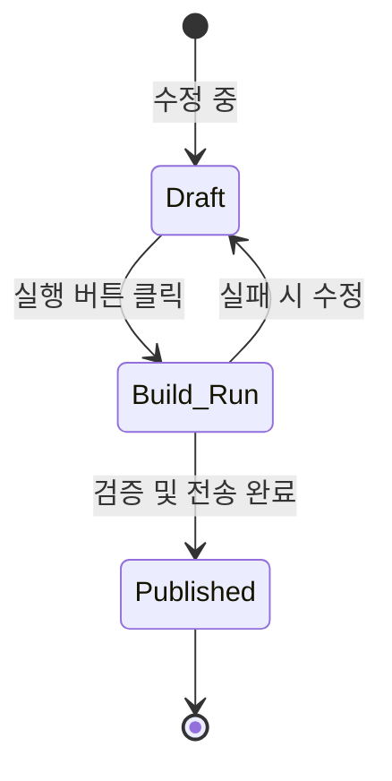
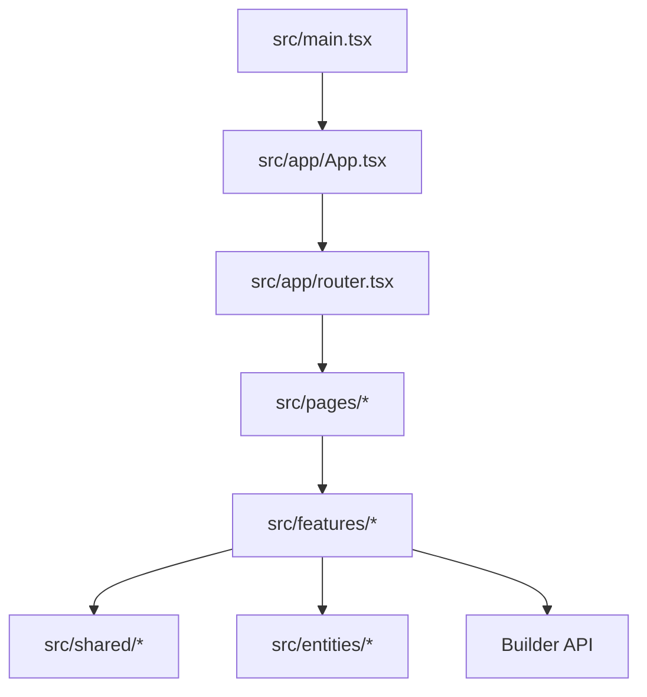
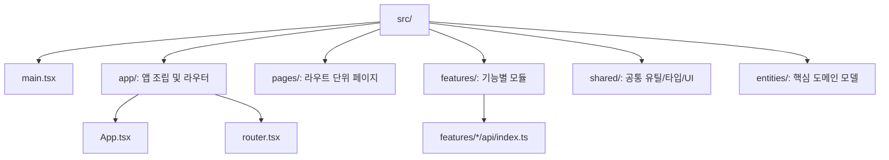

# KPubData Studio — Korea Public Data Studio

[](https://vite.dev/)
[](https://www.typescriptlang.org/)
[](LICENSE)

**KPubData Studio (Korea Public Data Studio)**는 KPubData 제품군의 시각적 인터페이스(UI — 사용자가 보고 조작하는 화면)입니다.

이 프로젝트는 사용자가 복잡한 설정 파일을 직접 수정하지 않고도 한국 공공데이터 빌드 과정을 기획, 미리보기, 실행 및 검사할 수 있도록 돕는 웹 기반 작업실입니다.

---

## 소개

KPubData Studio는 `kpubdata-builder` 출판사에서 만드는 **책(데이터셋)을 기획하고 미리보는 작업실**과 같습니다. 코딩 없이 버튼 몇 번으로 어떤 데이터를 가져올지 정하고, 결과가 어떻게 나올지 눈으로 확인하며 최종 출판까지 관리하는 웹 화면입니다.

KPubData Studio는 데이터셋을 설계·미리보기·실행하는 dataset workbench UI입니다.

## 이 프로젝트가 존재하는 이유

한국 공공데이터를 다루는 과정은 종종 복잡하고 기술적인 진입장벽이 존재합니다.
- **YAML 편집의 어려움**: [YAML](https://ko.wikipedia.org/wiki/YAML)은 들여쓰기로 구조를 표현하는 텍스트 설정 파일인데, 빈칸 하나만 잘못 넣어도 오류가 나서 직접 수정하기 어렵습니다.
- **시각적 피드백의 부재**: 데이터를 실제로 빌드하기 전에 결과물이 어떻게 보일지 미리 확인하는 기능이 중요합니다.
- **비개발자 접근성**: 코딩 경험이 없는 사용자나 기획자도 공공데이터 처리 과정을 손쉽게 구성하고 관리할 수 있어야 합니다.

## 핵심 개념

| 용어 | 설명 |
| :--- | :--- |
| **Draft** | 아직 저장되지 않은 임시 기획 상태 (편집 중) |
| **Build Run** | 실제로 빌드를 돌려 데이터를 가져오는 과정 |
| **Preview** | 빌드 결과물을 미리 눈으로 확인하는 화면 |
| **State Model** | 기획(Draft)부터 실행(Run), 출판(Publish)까지의 상태 흐름도 |
| **Studio Shell** | 전체 웹 화면을 구성하는 기본 틀과 내비게이션 |
| **UI Spec** | 화면의 각 요소가 어떻게 보이고 반응해야 하는지에 대한 약속 |

## 상태 모델 (State Model)

사용자가 작업을 시작하면 데이터는 다음 순서로 상태가 변합니다:


```mermaid
stateDiagram-v2
    [*] --> Draft: 수정 중
    Draft --> Build_Run: 실행 버튼 클릭
    Build_Run --> Published: 검증 및 전송 완료
    Build_Run --> Draft: 실패 시 수정
    Published --> [*]
```

- **Draft**: 사용자가 내용을 고치고 있는 상태입니다. (수정 중)
- **Build Run**: '실행' 버튼을 눌러 실제로 데이터를 모으는 중입니다.
- **Published**: 모든 검증을 마치고 결과물이 공유된 상태입니다.

## 기술 스택

| 기술 | 버전 | 설명 |
| :--- | :--- | :--- |
| **[Vite](https://vite.dev/)** | 8 | 빠른 개발 서버와 번들링을 제공하는 프런트엔드 빌드 도구 |
| **[React](https://ko.react.dev/)** | 19 | 화면을 작은 조각(컴포넌트)으로 나누어 만드는 UI 라이브러리 |
| **[React Router](https://reactrouter.com/)** | 7 | 브라우저에서 클라이언트 사이드 라우팅을 담당하는 내비게이션 라이브러리 |
| **[TanStack Query](https://tanstack.com/query)** | 5 | 서버 상태를 관리하고 Builder API 데이터를 가져오며 캐싱하는 데이터 패칭 라이브러리 |
| **[Zustand](https://zustand-demo.pmnd.rs/)** | 5 | 경량 전역/로컬 UI 상태를 관리하는 스토어로, 편집기 임시 저장과 UI 세션 상태에 사용 |
| **[TypeScript](https://www.typescriptlang.org/ko/docs/)** | 5 | 자바스크립트에 타입(자료형)을 추가하여 실수를 줄여주는 언어 |
| **[Tailwind CSS](https://tailwindcss.com/docs)** | 4 | HTML에 직접 디자인 클래스를 적용하는 스타일링 도구 |

## 설치 및 실행 방법

개발 환경을 설정하려면 [npm](https://docs.npmjs.com/about-npm)(Node.js 패키지 관리 도구)을 사용하여 다음 명령어를 실행하세요:

```bash
git clone https://github.com/yeongseon/kpubdata-studio.git
cd kpubdata-studio
npm install
npm run dev
```

`npm run dev`는 Vite 개발 서버를 실행합니다. 그 후 브라우저에서 [http://localhost:5173](http://localhost:5173)을 엽니다.

## 주요 기능 소개

- **빌드 기획서 작성**: 화면에서 클릭과 입력만으로 데이터셋 빌드 규칙을 간편하게 설정합니다.
- **실시간 미리보기**: 설정한 규칙에 따라 데이터가 어떤 모습으로 정리될지 즉시 확인합니다.
- **빌드 실행 및 모니터링**: `kpubdata-builder`와 연동하여 실제 데이터 수집 과정을 실시간으로 추적합니다.
- **결과물 검사**: 생성된 데이터 파일의 구조와 내용을 눈으로 확인하고 검사합니다.

## 애플리케이션 실행 흐름


```mermaid
graph TD
    Main[src/main.tsx] --> App[src/app/App.tsx]
    App --> Router[src/app/router.tsx]
    Router --> Pages[src/pages/*]
    Pages --> Features[src/features/*]
    Features --> Shared[src/shared/*]
    Features --> Entities[src/entities/*]
    Features --> BuilderAPI[Builder API]
```

```text
src/main.tsx -> src/app/App.tsx -> src/app/router.tsx -> src/pages/* -> src/features/* -> Builder API
```

## 파일 구조 가이드


```mermaid
graph TD
    src[src/] --> main[main.tsx]
    src --> app[app/: 앱 조립 및 라우터]
    src --> pages[pages/: 라우트 단위 페이지]
    src --> features[features/: 기능별 모듈]
    src --> shared[shared/: 공통 유틸/타입/UI]
    src --> entities[entities/: 핵심 도메인 모델]

    app --> AppFile[App.tsx]
    app --> RouterFile[router.tsx]
    features --> FeatureApi[features/*/api/index.ts]
```

```text
src/
├── main.tsx                    # Vite 엔트리 포인트
├── app/
│   ├── App.tsx                # RouterProvider 연결
│   └── router.tsx             # React Router 설정 및 App Shell
├── pages/                     # 라우트 단위 페이지 컴포넌트
├── features/                  # 기능별 UI/API/상태 모듈
│   └── */api/index.ts         # 기능별 Builder API 연동 진입점
├── shared/                    # 공통 config, hooks, lib, types, ui
└── entities/                  # build, dataset, manifest, artifact 도메인 모델
```

## 개발 스크립트

| 스크립트 | 설명 |
| :--- | :--- |
| `npm run dev` | Vite 개발 서버 실행 |
| `npm run lint` | ESLint 검사 |
| `npm test` | Vitest 테스트 실행 |
| `npm run build` | Vite 프로덕션 빌드 |
| `npm run preview` | 빌드 결과 로컬 프리뷰 |

---

## 문서 가이드 (Document Guide)

### 핵심 설계
| 문서 | 설명 |
| :--- | :--- |
| [ARCHITECTURE.md](./ARCHITECTURE.md) | Studio 시스템 아키텍처 및 설계 원칙 |
| [STATE_MODEL.md](./STATE_MODEL.md) | 빌드 상태 전이 및 UI 상태 관리 모델 |
| [UI_SPEC.md](./UI_SPEC.md) | 사용자 인터페이스 컴포넌트 및 디자인 규격 |
| [USER_FLOWS.md](./USER_FLOWS.md) | 주요 사용자 시나리오 및 화면 흐름도 |
| [INFORMATION_ARCHITECTURE.md](./INFORMATION_ARCHITECTURE.md) | 메뉴 구조 및 데이터 계층 구조 |
| [API_CONTRACT.md](./API_CONTRACT.md) | Builder API와의 통신 규약 및 데이터 모델 |

### 개발 가이드
| 문서 | 설명 |
| :--- | :--- |
| [AGENTS.md](./AGENTS.md) | AI 에이전트 협업 가이드 및 프롬프트 지침 |
| [CONTRIBUTING.md](./CONTRIBUTING.md) | 프로젝트 기여 방법 및 개발 환경 설정 |

### 프로젝트 관리
| 문서 | 설명 |
| :--- | :--- |
| [PRD.md](./PRD.md) | 제품 요구사항 정의 및 목표 |
| [ROADMAP.md](./ROADMAP.md) | 향후 개발 계획 및 마일스톤 |

### 자세한 참고
| 문서 | 설명 |
| :--- | :--- |
| [docs/adrs/0001-studio-as-control-surface.md](./docs/adrs/0001-studio-as-control-surface.md) | 결정 기록: Studio를 제어 인터페이스로 정의 |
| [제품군 전체 아키텍처](https://github.com/yeongseon/kpubdata/blob/main/docs/product-family-architecture.md) | **KPubData 3개 저장소의 전체 시스템 아키텍처** |

---

## KPubData Product Family

| 패키지 | 역할 |
| :--- | :--- |
| [kpubdata](https://github.com/yeongseon/kpubdata) | 한국 공공데이터 접근 + 파싱 + 정규화 코어 |
| [kpubdata-builder](https://github.com/yeongseon/kpubdata-builder) | 데이터셋 조립 + 내보내기 파이프라인 |
| [kpubdata-studio](https://github.com/yeongseon/kpubdata-studio) | 빌드 작성 및 실행을 위한 시각적 인터페이스 |

---

## 관련 문서

### 이 저장소 내 문서
| 문서 | 설명 |
| :--- | :--- |
| [ARCHITECTURE.md](./ARCHITECTURE.md) | 시스템 아키텍처 설계 |
| [STATE_MODEL.md](./STATE_MODEL.md) | 상태 관리 모델 |
| [UI_SPEC.md](./UI_SPEC.md) | UI 디자인 규격 |
| [USER_FLOWS.md](./USER_FLOWS.md) | 사용자 흐름도 |
| [INFORMATION_ARCHITECTURE.md](./INFORMATION_ARCHITECTURE.md) | 정보 구조 설계 |
| [API_CONTRACT.md](./API_CONTRACT.md) | API 연동 규약 |
| [AGENTS.md](./AGENTS.md) | 에이전트 가이드 |
| [CONTRIBUTING.md](./CONTRIBUTING.md) | 기여 가이드 |
| [PRD.md](./PRD.md) | 제품 요구사항 |
| [ROADMAP.md](./ROADMAP.md) | 개발 로드맵 |

### Keycloak OIDC 인증 (실연동 Builder)

실연동 Builder 흐름은 self-hosted Keycloak realm을 통해 사람 사용자를 인증한다 —
Authorization Code Flow + PKCE(S256). Studio는 public SPA이므로 프런트엔드에 **client
secret이 없다**. 이메일/비밀번호 로그인, 이메일 인증, 비밀번호 재설정, 토큰 갱신,
로그아웃은 모두 Keycloak의 책임이며 Studio는 비밀번호를 보거나 저장하지 않는다.

실연동 `/login`에서는 두 가지 로그인 경로를 제공한다.

- **Google로 계속하기**: `keycloakLogin(returnTo, "google")`을 사용해 Keycloak의
  Google Identity Broker를 통해 인증한다.
- **KPubData 계정으로 로그인**: `keycloakLogin(returnTo)`을 사용해 Keycloak이
  제공하는 로그인 화면으로 이동한다.

두 경로 모두 Keycloak을 Authorization Server로 사용하며, Google 인증을 Studio가
직접 처리하거나 Google 토큰을 Builder에 직접 전달하지 않는다.
mock/demo 모드(`VITE_USE_REAL_BUILDER` 미설정)에서는 기존 이메일/비밀번호 폼을 그대로 쓴다.

```dotenv
# Studio .env.local (커밋 금지)
VITE_USE_REAL_BUILDER=true
VITE_BUILDER_API_URL=http://localhost:8000
VITE_OIDC_ISSUER=http://localhost:8080/realms/kpubdata
VITE_OIDC_CLIENT_ID=kpubdata-studio
```

Keycloak client(`kpubdata-studio`) 설정: public client(client auth OFF), Standard Flow ON,
Direct Access Grants OFF, PKCE `S256` 필수, access-token audience `kpubdata-builder`,
Google를 Identity Provider로 연결.

**Valid Redirect URIs / Web Origins (로컬 개발 기준):**

- Web Origins: `http://localhost:5173`
- Valid Redirect URIs에는 다음 두 가지가 모두 매칭돼야 한다:
  - **로그인 callback** — `keycloakLogin`이 `/login?returnTo=...`로 돌아온다.
  - **silent SSO callback** — `initKeycloak()`이 숨은 iframe으로 세션을 조용히 확인할 때
    `redirect_uri`로 `/silent-check-sso.html`(앱 `BASE_URL` 하위)을 보낸다. 이 경로가
    Valid Redirect URI에 없으면 최초 silent SSO 확인이 거부되어 Studio가 인증 오류
    화면에 머문다.
- 로컬에서는 `http://localhost:5173/silent-check-sso.html`과 로그인 callback의
  query string까지 허용하는 패턴(예: `http://localhost:5173/login*`)을 등록하거나,
  개발 편의상 `http://localhost:5173/*` 하나로 둘 다 커버할 수 있다.
- **production에서는 넓은 wildcard(`https://<host>/*` 또는 `*`)를 기본값으로 쓰지 않는다.**
  production 배포 origin에 대해 실제로 사용하는 silent SSO callback과 로그인 callback만
  허용하고, 로그인 callback에 필요한 경우 `/login*`처럼 가능한 좁은 범위의 패턴을 사용한다.
  sub-path 배포라면 `BASE_URL`도 포함한다.

- `VITE_OIDC_ISSUER`는 전체 issuer URL(`.../realms/<realm>`)이다. Studio가 여기서
  Keycloak base URL과 realm을 파생한다. issuer/client id가 없거나 형식이 잘못되면
  화면에 보이는 오류로 fail-closed된다 — Studio는 사용자가 인증됐다고 가정하지 않는다.
- access token은 `keycloak-js`의 메모리 세션에만 존재한다. Studio는 공유 Builder 요청
  경계에서 `Authorization: Bearer <token>`을 붙이고 만료 임박 토큰을 그 자리에서 갱신한다.
  `localStorage`/`sessionStorage`나 로그에는 아무것도 쓰지 않는다.
- Builder의 기존 `X-API-Key` 경로는 영향받지 않는다.

#### Builder side (real OIDC verification)

The Builder must be started **without `KPUBDATA_BUILDER_DEV_MODE`**. Builder's
`authenticate()` handles dev mode first and returns a `dev` principal *before any Bearer
JWT is inspected*, so a Builder running with `KPUBDATA_BUILDER_DEV_MODE=1` accepts every
request and proves nothing about the OIDC path. Dev mode is only for the mock-token-free
data-path E2E described below — never for authentication verification.

Builder reads these environment variables (see `kpubdata-builder` `service/auth.py` /
its README "Docker deployment"):

| Variable | Value (local example) | Notes |
| :--- | :--- | :--- |
| `OIDC_ISSUER` | `http://localhost:8080/realms/kpubdata` | Enables the Bearer path. Must equal `VITE_OIDC_ISSUER`. |
| `OIDC_AUDIENCE` | `kpubdata-builder` | Required once `OIDC_ISSUER` is set (fail-closed if missing). Must match the Studio client's access-token audience. |
| `OIDC_ALLOWED_EMAILS` | *(the Keycloak test user's email)* | Comma-separated allowlist. Use `OIDC_ALLOWED_SUBJECTS` instead to allowlist by `sub`. |
| `KPUBDATA_BUILDER_ALLOWED_ORIGINS` | `http://localhost:5173` | CORS is default-deny; must list the Studio dev origin. |

Builder needs the `auth` optional dependency (`pyjwt[crypto]>=2.9,<3`, declared as the
`auth` extra in `kpubdata-builder`'s `pyproject.toml`) for JWT verification. Install and
run it with the extra present — do **not** rely on a bare install:

```bash
# from PyPI
pip install "kpubdata-builder[auth]"
OIDC_ISSUER=http://localhost:8080/realms/kpubdata \
OIDC_AUDIENCE=kpubdata-builder \
OIDC_ALLOWED_EMAILS=<keycloak-test-user-email> \
KPUBDATA_BUILDER_ALLOWED_ORIGINS=http://localhost:5173 \
kpubdata-builder serve --host 127.0.0.1 --port 8000 --output-dir ./dist

# or from a local checkout (../kpubdata-builder)
OIDC_ISSUER=http://localhost:8080/realms/kpubdata \
OIDC_AUDIENCE=kpubdata-builder \
OIDC_ALLOWED_EMAILS=<keycloak-test-user-email> \
KPUBDATA_BUILDER_ALLOWED_ORIGINS=http://localhost:5173 \
uv run --project ../kpubdata-builder --extra auth \
  kpubdata-builder serve --host 127.0.0.1 --port 8000 --output-dir ./dist
```

#### `email_verified` precondition

Builder rejects any OIDC token whose payload does not carry `email_verified: true`
(`authenticate()` returns an auth error otherwise). Therefore, before the smoke run:

- The Keycloak **test user must have "Email verified" = ON** (Users → *user* → Details).
- The `kpubdata-studio` client must include the `email` client scope so the issued
  **access token** carries `email` and `email_verified` claims (Client scopes → `email`
  as Default; verify with the Keycloak "Evaluate" tab or by decoding the access token).

If either is missing, Builder answers protected endpoints with 401/403 even though the
Studio login succeeded.

### Local real-Builder data-path E2E (auth bypassed on both sides)

`npm run test:e2e:real` (→ `scripts/run-real-e2e.mjs`) exercises the Studio → Builder →
`kpubdata` ingestion → manifest data path **without** a running Keycloak. It is **not**
an authentication test: it sets `VITE_DEV_BYPASS_AUTH=true` on the Studio dev server and
`KPUBDATA_BUILDER_DEV_MODE=1` on the Builder, so **no Bearer token is issued or verified
on either side**. Real OIDC E2E cannot be observed in this mode — use the manual smoke
below for that.

```dotenv
# Studio .env.local (do not commit)
VITE_USE_REAL_BUILDER=true
VITE_BUILDER_API_URL=http://localhost:8000
VITE_DEV_BYPASS_AUTH=true
```

```bash
KPUBDATA_BUILDER_DEV_MODE=1
KPUBDATA_BUILDER_ALLOWED_ORIGINS=http://localhost:5173
uv run --with "pandas>=2.2,<3" kpubdata-builder serve --host 127.0.0.1 --port 8000 --output-dir ./dist
```

`VITE_DEV_BYPASS_AUTH` takes effect only in Vite development (`import.meta.env.DEV`); a
production build never bypasses the login gate. Use `KPUBDATA_BUILDER_DEV_MODE=1` only in
a local development environment.

### Keycloak → Builder OIDC smoke (manual)

Run this to confirm the real authentication path end to end. It requires a running
Keycloak realm and a Builder started **with `OIDC_ISSUER` set and `KPUBDATA_BUILDER_DEV_MODE`
unset** (see "Builder side" above). It cannot be automated here — perform the steps
manually and check every item.

**Preconditions**

1. Keycloak realm `kpubdata` up on `http://localhost:8080` with the `kpubdata-studio`
   public client and a `kpubdata-builder` audience mapper on its access token.
2. A Keycloak test user with a password **and "Email verified" = ON**.
3. Builder running with `OIDC_ISSUER`, `OIDC_AUDIENCE`, `OIDC_ALLOWED_EMAILS`
   (or `OIDC_ALLOWED_SUBJECTS`), `KPUBDATA_BUILDER_ALLOWED_ORIGINS`, and the `auth`
   extra installed. **No `KPUBDATA_BUILDER_DEV_MODE`.**
4. Studio started with `npm run dev` and `.env.local` containing `VITE_USE_REAL_BUILDER`,
   `VITE_BUILDER_API_URL`, `VITE_OIDC_ISSUER`, `VITE_OIDC_CLIENT_ID` — and
   **`VITE_DEV_BYPASS_AUTH` unset** (any value makes `getOidcConfig()` return `disabled`).

**Steps**

1. Open `http://localhost:5173` while logged out → Studio's LoginGate shows the Keycloak
   sign-in prompt and does not render Builder screens.
2. Sign in on the Keycloak-hosted page with the test user.
3. Browser returns to `http://localhost:5173`; Studio renders the app shell (LoginGate
   `oidcStatus === "authenticated"`).
4. Trigger a Builder call (e.g. open a screen that loads `/version` or run Preview) and
   inspect the request in DevTools → Network.
5. In DevTools → Application, inspect `localStorage` and `sessionStorage`.
6. From a terminal, call a protected Builder endpoint with no token and with a garbage
   token.
7. Go to Settings → Account → **Logout**.
8. After the Keycloak logout redirect completes, revisit a protected Studio route.

**Success criteria** — all must hold:

- [ ] Logged-out Studio redirects into Keycloak login; protected screens are not shown.
- [ ] After Keycloak login the browser returns to Studio and the app shell renders.
- [ ] The Builder request carries an `Authorization: Bearer <access token>` header.
- [ ] With **no** `KPUBDATA_BUILDER_DEV_MODE`, Builder accepts that request (2xx).
- [ ] A request with a missing or malformed token is rejected (401/403) on a protected
      Builder endpoint.
- [ ] Builder logs/response show the request handled as an **`oidc` principal**
      (`kind="oidc"`), not `dev` or `service`.
- [ ] Neither `localStorage` nor `sessionStorage` contains a raw access or refresh token;
      Studio code never writes one (tokens stay in the `keycloak-js` in-memory session).
- [ ] Settings → Logout triggers Keycloak logout; afterwards every protected Studio route
      is back to the unauthenticated state and re-prompts for login.

### KPubData Product Family
| 저장소 | 문서 | 설명 |
| :--- | :--- | :--- |
| [kpubdata](https://github.com/yeongseon/kpubdata) | [ARCHITECTURE.md](https://github.com/yeongseon/kpubdata/blob/main/ARCHITECTURE.md) | Core 아키텍처 |
| [kpubdata-builder](https://github.com/yeongseon/kpubdata-builder) | [ARCHITECTURE.md](https://github.com/yeongseon/kpubdata-builder/blob/main/ARCHITECTURE.md) | Builder 아키텍처 |

---

## 초기 배포 목표

- **v0.1**: Vite + React SPA 셸 구성, React Router 기반 화면 전환, feature 기반 모듈 구조 정착, Builder API 연동 기초 작업
- **v0.2**: 실시간 미리보기 기능, 데이터 검증 뷰, 빌드 결과물 뷰어 구현
- **v0.3**: 최종 게시(Publish) 워크플로우 완성 및 전체 프로젝트 대시보드 제공

---

## 오리진 정합 — Google Console ↔ Builder CORS (#194, S9)

실연동 모드에서 Studio가 Builder를 호출하려면 **같은 오리진 목록**을 양쪽에 등록해야 한다:

1. **Google Cloud Console** → APIs & Services → Credentials → OAuth client ID → **Authorized JavaScript origins**
2. **Builder** → `KPUBDATA_BUILDER_ALLOWED_ORIGINS` 환경변수 (CORS default-deny)

두 값이 어긋나면 증상이 **CORS 오류**로 나타나 원인 추적이 어렵다. 로컬과 실배포 오리진을 모두 양쪽에 등록할 것.

| 환경 | Studio 오리진 | Google Console | Builder CORS env |
| :--- | :--- | :--- | :--- |
| 로컬 개발 | `http://localhost:5173` | ✅ 등록 | ✅ 등록 |
| 실배포 | `https://<studio-host>` | ✅ 등록 | ✅ 등록 |
| Pages 데모 | `https://yeongseon.github.io` | ❌ (mock 모드, Builder 호출 안 함) | ❌ |

> Pages 데모는 mock 모드(`VITE_USE_REAL_BUILDER` 미설정)라 Builder를 호출하지 않으므로 등록 대상이 아니다.
