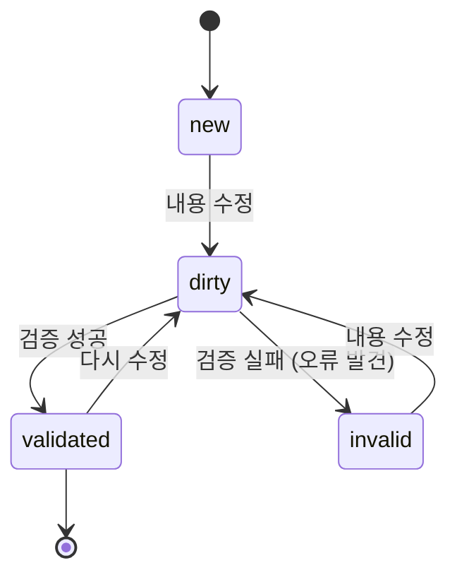
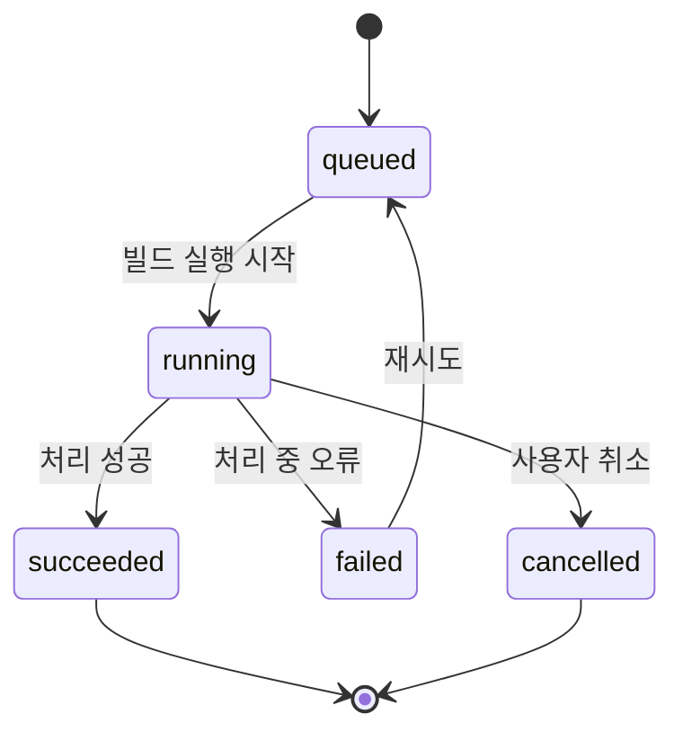
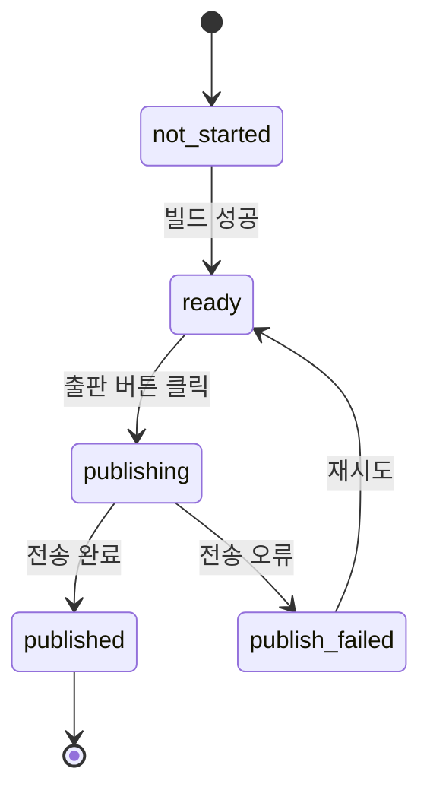
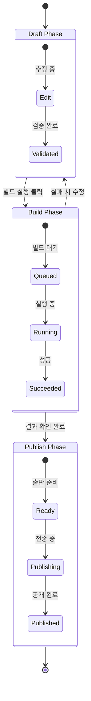

# State Model — KPubData Studio

## "상태(State)란 무엇인가요?" (초보자용 설명)

상태는 애플리케이션 안의 데이터가 현재 처해 있는 **상황**입니다.

- **비유**: "식당에서 주문하는 과정과 비슷합니다. 메뉴판을 보며 고르는 중(**Draft**) → 주문을 넣음(**Build Run**) → 음식이 서빙됨(**Publish**)"
- 사용자의 행동(클릭, 입력)에 따라 상태가 변하고, 상태가 변하면 화면에 보이는 내용도 달라집니다.

---

## 1. Draft State (편집 중인 상태)

사용자가 빌드 설정을 만들거나 수정하고 있는 임시 저장 단계입니다. 아직 실제로 데이터를 가져오지는 않습니다.

### Statuses
- `new`: 방금 새로 만든 깨끗한 상태
- `dirty`: 내용이 수정되었지만 아직 검증되지 않은 상태
- `validated`: 모든 설정값이 올바른지 확인(검증)을 마친 상태
- `invalid`: 설정값에 오류가 있어 수정이 필요한 상태

### 상태 전이 흐름 (ASCII Diagram)
```text
[new] --(수정)--> [dirty] --(검증 요청)--> [validated]
                     ^           |
                     |           | (오류 발견)
                     +-----------+-------- [invalid]
```



### 사용자의 행동과 UI 반응
- **수정 중일 때**: "저장" 버튼이 활성화됩니다.
- **검증 완료 시**: "빌드 실행" 버튼이 활성화됩니다.
- **오류 발생 시**: 화면 상단에 붉은색 에러 메시지가 표시됩니다.

---

## 2. Build Run State (빌드 실행 중인 상태)

'빌드 실행' 버튼을 눌러 실제로 데이터를 수집하고 파일을 만드는 과정의 상태입니다.

### Statuses
- `queued`: 대기열에서 차례를 기다리는 중
- `running`: 실제로 데이터를 수집하고 처리하는 중
- `succeeded`: 모든 데이터 처리가 성공적으로 완료됨
- `failed`: 작업 도중 오류가 발생하여 중단됨
- `cancelled`: 사용자가 수동으로 작업을 멈춤

### 상태 전이 흐름 (ASCII Diagram)
```text
[queued] -> [running] --(성공)--> [succeeded]
               |
               +--(실패)--> [failed]
               |
               +--(취소)--> [cancelled]
```



### 사용자의 행동과 UI 반응
- **실행 중**: 실시간 로그 화면이 보이며, "취소" 버튼을 누를 수 있습니다.
- **성공 시**: 결과 파일 목록이 보이고, "미리보기"가 가능해집니다.
- **실패 시**: 어떤 단계에서 오류가 났는지 로그를 확인할 수 있습니다.

---

## 3. Publish State (출판/공유 상태)

빌드 완료된 결과물을 다른 사람에게 공유하거나 외부 저장소(예: HuggingFace)로 보내는 단계입니다.

### Statuses
- `not_started`: 출판 준비 전
- `ready`: 출판 가능한 상태 (빌드 성공 후)
- `publishing`: 데이터를 외부로 전송 중
- `published`: 전송이 완료되어 공개된 상태
- `publish_failed`: 전송 도중 오류 발생



---

## 4. Complete Lifecycle (전체 생명주기)

Draft부터 시작하여 Build Run을 거쳐 Publish까지 이르는 전체 흐름입니다.



---

## "상태와 UI의 관계" 요약

상태는 사용자가 지금 무엇을 해야 하는지, 무엇을 할 수 있는지를 결정하는 **지침**이 됩니다.

| 현재 상태 | UI에서 보여줄 모습 | 가능한 주요 버튼 |
| :--- | :--- | :--- |
| `dirty` | "저장되지 않은 변경사항이 있습니다." | [저장], [검증] |
| `invalid` | 오류 목록 표시 (붉은색) | [수정 필요] |
| `running` | 진행률 표시바 (Progress Bar) | [취소] |
| `succeeded` | "빌드가 완료되었습니다!" | [미리보기], [출판] |
| `published` | 공유 링크 (URL) 표시 | [링크 복사] |

---

## 관련 문서

### 이 저장소 내 문서
| 문서 | 설명 |
| :--- | :--- |
| [ARCHITECTURE.md](./ARCHITECTURE.md) | 시스템 아키텍처 설계 |
| [UI_SPEC.md](./UI_SPEC.md) | UI 컴포넌트 규격 |
| [USER_FLOWS.md](./USER_FLOWS.md) | 사용자 시나리오 및 흐름 |
| [API_CONTRACT.md](./API_CONTRACT.md) | API 통신 규약 |

### KPubData Product Family
| 저장소 | 문서 | 설명 |
| :--- | :--- | :--- |
| [kpubdata](https://github.com/yeongseon/kpubdata) | [ARCHITECTURE.md](https://github.com/yeongseon/kpubdata/blob/main/ARCHITECTURE.md) | Core 아키텍처 |
| [kpubdata-builder](https://github.com/yeongseon/kpubdata-builder) | [ARCHITECTURE.md](https://github.com/yeongseon/kpubdata-builder/blob/main/ARCHITECTURE.md) | Builder 아키텍처 |
