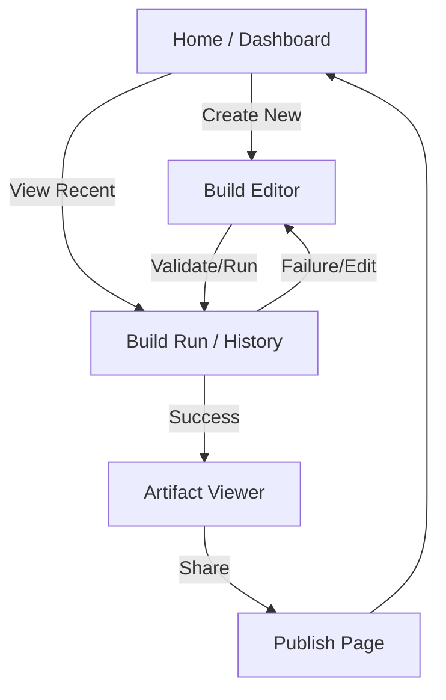
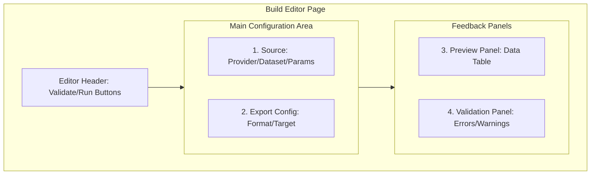

# UI 명세 — KPubData Studio

## 1. 화면 내비게이션 흐름



## 2. 주요 화면 및 와이어프레임

### [Home] 대시보드
빌드 목록을 한눈에 보고 빠르게 작업을 시작하는 곳입니다.

**와이어프레임:**
```text
+--------------------------------------------------+
| [Header] KPubData Studio          [User Profile] |
+--------------------------------------------------+
| [Sidebar]    |                                   |
| - Dashboard  |  [ + New Build ] [ Quick Actions ]|
| - Builds     |                                   |
| - Settings   |  Recent Build Runs                |
|              |  +-----------------------------+  |
|              |  | ID | Status | Time | Action |  |
|              |  |----|--------|------|--------|  |
|              |  | 01 | Success| 2min | View   |  |
|              |  +-----------------------------+  |
+--------------+-----------------------------------+
```
- **상호작용**:
  - `[ + New Build ]`: 새로운 빌드 작성 페이지(`/builds/new`)로 이동합니다.
  - `[ View ]`: 해당 빌드의 상세 결과 페이지로 이동합니다.
- **API**: `GET /artifacts/{run_id}` (특정 빌드 결과물 조회), 빌드 목록은 현재 로컬 상태에서 조회합니다.

> **계획(planned)/미구현**: 빌드 목록 조회(`GET /builds`)는 현재 Builder API에 존재하지 않습니다.

---

### [Build Editor] 빌드 편집기
빌드 어떤 데이터를 어떻게 수집할지 기획서를 작성하는 곳입니다.



**와이어프레임:**
```text
+--------------------------------------------------+
| < Back to List         [ Validate ] [ Run Build ]|
+--------------------------------------------------+
| [1. Source]          | [3. Preview Panel]        |
| + Provider Choice    |                           |
| + Dataset Choice     | (Sample Data Table)       |
| + Parameters Input   |                           |
|                      |                           |
| [2. Export Config]   | [4. Validation Panel]     |
| + Format (JSON/MD..) |                           |
| + Target (HF/Local)  | (Warnings/Errors List)    |
+----------------------+---------------------------+
```
- **상호작용**:
  - `Provider/Dataset Choice`: 선택 시 관련 파라미터 입력란이 자동으로 나타납니다.
  - `[ Validate ]`: 현재 설정이 올바른지 확인합니다. (Validation Panel 업데이트)
  - `[ Run Build ]`: 검증이 완료된 상태에서만 활성화되며, 누르면 실제 빌드가 시작됩니다.
- **API**:
  - `POST /validate`: 설정값 검증
  - `POST /preview`: 샘플 데이터 미리보기

> **계획(planned)/미구현**: `GET /providers` 엔드포인트는 현재 Builder API에 존재하지 않습니다. 제공 기관 목록은 현재 Studio 내에 하드코딩된 목록으로 제공됩니다.

---

### [Build Run] 빌드 실행 화면
빌드가 진행되는 과정을 실시간으로 지켜보는 곳입니다.

**와이어프레임:**
```text
+--------------------------------------------------+
| Build #123 - Running...           [ Cancel Build ]|
+--------------------------------------------------+
| Status: [====------] 40%                         |
|                                                  |
| [ Execution Logs ]                               |
| 10:00:01 - Fetching data from data.go.kr...      |
| 10:00:05 - Normalizing records...                |
| 10:00:08 - Converting to Markdown...             |
+--------------------------------------------------+
```
- **상호작용**:
  - `[ Cancel Build ]`: 실행 중인 작업을 즉시 중단합니다.
- **API**: `POST /build` (동기 빌드 실행, 완료까지 블로킹)

> **계획(planned)/미구현**: 비동기 상태 폴링(`GET /builds/:id/status`) 및 취소(`DELETE /builds/:id`)는 현재 구현되어 있지 않습니다. 현재 `POST /build`는 동기식으로 동작합니다.

---

## 3. 화면별 API 호출 지도

```mermaid
graph LR
    subgraph Screens [Studio 화면]
        HomeS[Home Dashboard]
        EditorS[Build Editor]
        RunS[Build Run Tracking]
        ArtifactsS[Artifact Viewer]
        PublishS[Publish Page]
    end

    subgraph APIEndpoints [Builder API 엔드포인트]
        GET_Version[GET /version]
        POST_Validate[POST /validate]
        POST_Preview[POST /preview]
        POST_Build[POST /build]
        GET_Artifacts[GET /artifacts/{run_id}]
    end

    HomeS --> GET_Version
    EditorS --> POST_Validate
    EditorS --> POST_Preview
    EditorS --> POST_Build
    ArtifactsS --> GET_Artifacts
    RunS --> POST_Build
    PublishS -.->|계획/미구현| GET_Artifacts
```

> 라우팅은 React Router가 담당하며, 각 화면은 `src/pages/`에서 조립되고 실제 API 호출은 `src/features/*/api/index.ts`를 통해 수행됩니다.

## 4. 에러 및 예외 상태 처리

- **Loading State**: 데이터를 불러오는 동안 스피너(Spinner)나 스켈레톤(Skeleton) UI를 보여줍니다.
- **Empty State**: 목록이 없을 때 "아직 생성된 빌드가 없습니다. 첫 빌드를 만들어보세요!"라는 안내 문구를 보여줍니다.
- **Error State**:
  - **Network Error**: "서버와 연결이 끊겼습니다. 인터넷 연결을 확인해주세요."
  - **Validation Error**: 입력창 아래에 붉은색 글씨로 구체적인 오류 원인을 적어줍니다. (예: "날짜 형식은 YYYYMMDD여야 합니다.")

---

## 5. 화면별 명세 요약

| 화면명 | 주요 기능 | 호출 API |
| :--- | :--- | :--- |
| Home | 전체 현황 파악 | `GET /version` (계약 버전 확인) |
| Editor | 빌드 설정 기획 및 검증 | `POST /validate`, `POST /preview` |
| Run | 빌드 실행 (동기) | `POST /build` |
| Artifacts | 결과물 확인 및 다운로드 | `GET /artifacts/{run_id}` |
| Publish | 외부 저장소 배포 | **계획(planned)/미구현** |

---

## 관련 문서

### 이 저장소 내 문서
| 문서 | 설명 |
| :--- | :--- |
| [ARCHITECTURE.md](./ARCHITECTURE.md) | 시스템 아키텍처 설계 |
| [STATE_MODEL.md](./STATE_MODEL.md) | 상태 관리 모델 |
| [USER_FLOWS.md](./USER_FLOWS.md) | 사용자 흐름도 |
| [INFORMATION_ARCHITECTURE.md](./INFORMATION_ARCHITECTURE.md) | 정보 구조 설계 |

### KPubData Product Family
| 저장소 | 문서 | 설명 |
| :--- | :--- | :--- |
| [kpubdata](https://github.com/yeongseon/kpubdata) | [ARCHITECTURE.md](https://github.com/yeongseon/kpubdata/blob/main/ARCHITECTURE.md) | Core 아키텍처 |
| [kpubdata-builder](https://github.com/yeongseon/kpubdata-builder) | [ARCHITECTURE.md](https://github.com/yeongseon/kpubdata-builder/blob/main/ARCHITECTURE.md) | Builder 아키텍처 |
