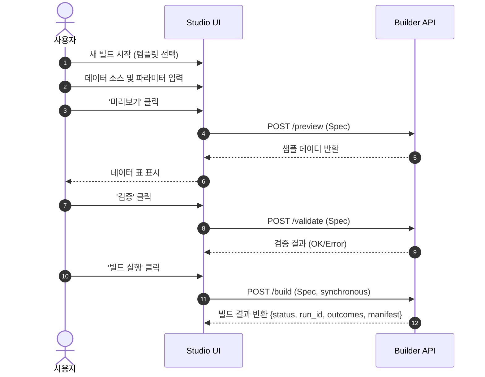
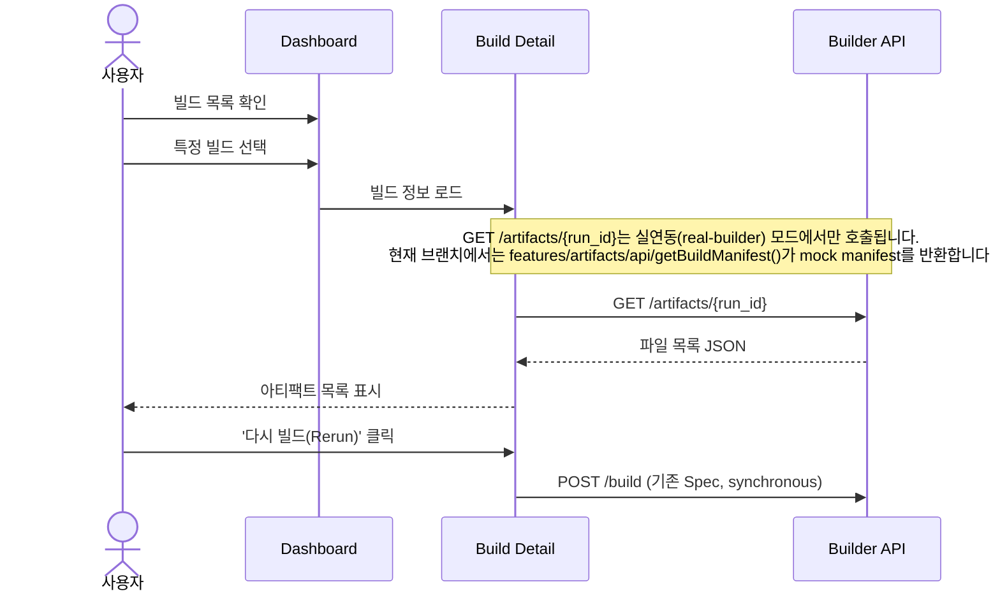
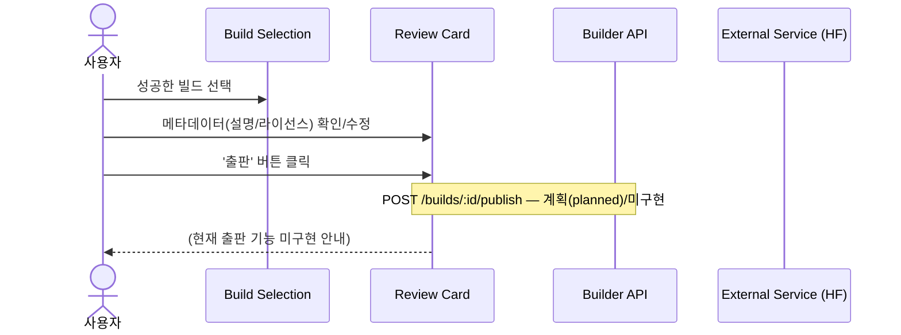
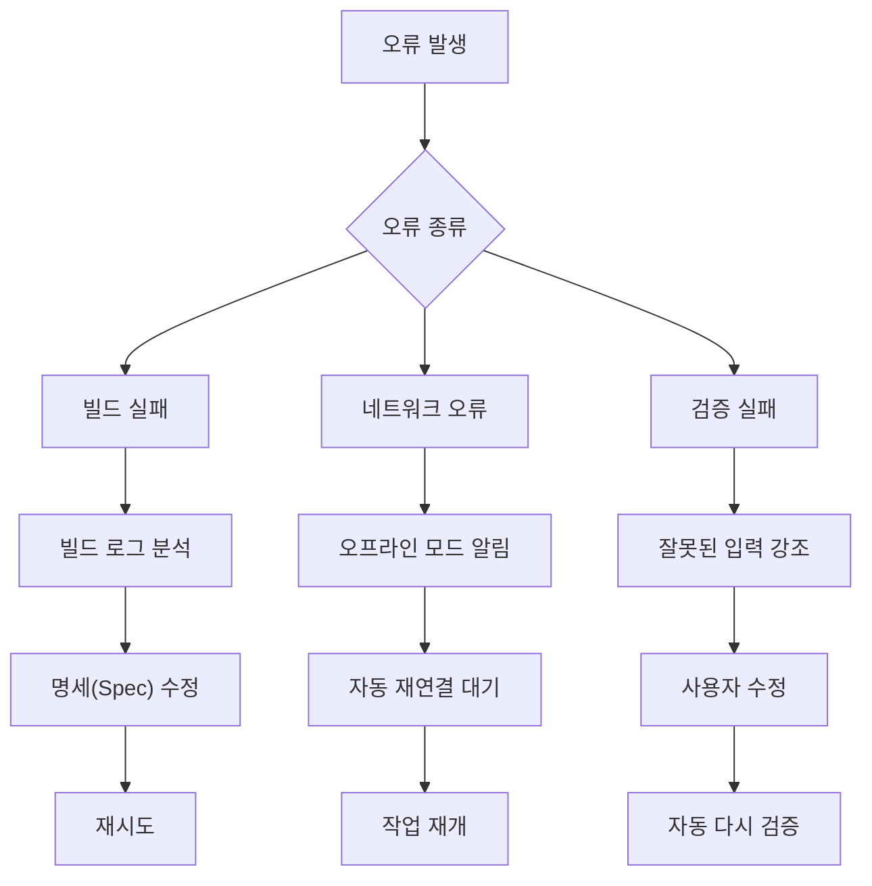

# 사용자 흐름 — KPubData Studio

> **참고**
>
> - 주요 화면의 스크린샷은 [화면 스크린샷](screenshots.md) 페이지에서 확인할 수 있습니다.
> - 각 화면(페이지)의 상세 설계는 [화면 설계서](screens/index.md)에서 페이지 단위로 확인할 수 있습니다.

## 0. 화면 라우트 맵

실제 배포된 화면(라우트)과 사용자 흐름의 대응 관계입니다. 각 화면의 상세 설계는 [화면 설계서](screens/index.md)를 참고하세요.

| 흐름 | 주요 화면(라우트) | 화면 설계서 |
| :--- | :--- | :--- |
| 진입/현황 파악 | 대시보드 `/` | [dashboard](screens/dashboard.md) |
| 새 빌드 위저드 | 새 빌드 `/builds/new` | [new-build](screens/new-build.md) |
| 빌드 검토·재실행 | 빌드 목록 `/builds` → 빌드 상세 `/builds/:id` | [builds](screens/builds.md) · [build-detail](screens/build-detail.md) |
| 실행 추적 | 실행 `/builds/:id/run` | [build-run](screens/build-run.md) |
| 결과물 확인 | 결과물 `/builds/:id/artifacts` | [build-artifacts](screens/build-artifacts.md) |
| 출판·공유 | 게시 `/builds/:id/publish` | [build-publish](screens/build-publish.md) |
| 환경설정 | 설정 `/settings` | [settings](screens/settings.md) |

> 현재 배포본(GitHub Pages)은 **MOCK 모드**로 동작하며, 화면 데이터는 데모 시드 데이터(`src/shared/lib/demoDatasets.ts`)에서 제공됩니다. `/validate`·`/preview`·`/artifacts`는 마법사/빌드 선택으로 안내하는 레거시 진입점입니다.

---

## 1. 새 빌드 위저드
데이터를 기획하고 첫 빌드를 성공시키기까지의 과정입니다.

> 이 흐름은 특정 프레임워크의 파일 라우팅 규칙에 의존하지 않으며, 현재 Studio에서는 React Router 기반 SPA 화면 전환으로 구현됩니다.

### 상세 단계
1. **템플릿 선택**: 사용자가 '새 빌드' 버튼을 누르고, 빈 페이지 혹은 미리 만들어진 템플릿(예: 동네예보)을 선택합니다.
2. **데이터 소스 추가**: 수집할 데이터 기관(Provider)과 데이터셋을 목록에서 고릅니다.
3. **파라미터 설정**: 필요한 검색 조건(날짜, 지역 등)을 입력창에 적습니다.
4. **미리보기 (Preview)**: '미리보기' 버튼을 눌러 실제 데이터가 어떤 모양으로 들어오는지 표 형식으로 확인합니다.
5. **결과물 형식 선택**: Markdown, JSONL, Parquet 등 원하는 파일 형식을 고릅니다.
6. **검증 (Validate)**: '검증' 버튼을 눌러 모든 설정이 완벽한지 시스템 확인을 거칩니다.
7. **실행 (Run)**: '빌드 실행' 버튼을 눌러 실제 데이터 수집을 시작합니다.

### 사용자가 경험하는 시나리오 예시
- **하는 일**: "서울시 강남구의 이번 달 미세먼지 농도 데이터를 마크다운 파일로 만들고 싶어."
- **시스템 반응**: 강남구 코드가 맞는지 검증하고, 미세먼지 API에서 샘플 데이터를 가져와 보여준 뒤, 빌드가 완료되면 다운로드 링크를 생성합니다.

---

## 2. 기존 빌드 검토 및 재실행
과거에 했던 작업을 다시 확인하거나 조금 수정해서 다시 실행하는 과정입니다.

### 상세 단계
1. **빌드 목록 조회**: 대시보드에서 과거의 빌드 기록을 하나 선택합니다.
2. **명세(Manifest) 확인**: 어떤 설정으로 빌드했는지, 데이터 소스는 무엇이었는지 상세 내용을 봅니다.
3. **결과 파일 확인**: 이미 생성된 아티팩트(파일)들을 다시 다운로드하거나 내용을 봅니다.
4. **재수정 후 실행 (Rerun)**: 설정을 조금만 바꿔서(예: 날짜만 오늘로 변경) 다시 빌드합니다.

---

## 3. 출판 및 공유 검토
완성된 데이터를 세상에 내놓는 최종 단계입니다.

### 상세 단계
1. **완료된 빌드 선택**: 성공 상태(`succeeded`)인 빌드를 고릅니다.
2. **데이터 카드 확인**: 데이터의 제목, 설명, 라이선스 정보가 잘 입력되었는지 봅니다.
3. **목적지 확인**: 어디로 보낼지(예: 내 컴퓨터, HuggingFace 등) 결정합니다.
4. **출판 실행**: '출판' 버튼을 눌러 공유를 완료합니다.

---

## 4. 에러 시나리오

### 빌드 실패
- **발생 원인**: 공공데이터 API 서버 장애, 혹은 잘못된 파라미터 값 입력.
- **사용자 경험**: 빌드 상태가 `failed`로 변하며 붉은색 경고 메시지가 보입니다.
- **시스템 대처**: "API 서버 응답이 없습니다. 잠시 후 다시 시도해주세요." 같은 구체적인 실패 원인 로그를 보여줍니다.

### 네트워크 오류
- **발생 원인**: 사용자의 인터넷 연결 끊김 혹은 Studio 서버 다운.
- **사용자 경험**: 화면이 멈추거나 "서버와 연결할 수 없습니다"라는 팝업이 뜹니다.
- **시스템 대처**: 오프라인 상태임을 알리고, 다시 연결되었을 때 작업을 재개할 수 있도록 안내합니다.

### 검증 실패
- **발생 원인**: 필수 입력값 누락, 혹은 형식에 어긋난 입력(예: 숫자 자리에 문자 입력).
- **사용자 경험**: '빌드 실행' 버튼이 비활성화되고, 잘못된 입력창 주위에 붉은색 테두리가 생깁니다.
- **시스템 대처**: "날짜는 YYYYMMDD 형식을 지켜주세요" 등 해결 방법을 직접 제안합니다.

---

## 5. 에러 복구 흐름

---

## 관련 문서

### 이 저장소 내 문서
| 문서 | 설명 |
| :--- | :--- |
| [UI_SPEC.md](./UI_SPEC.md) | UI 컴포넌트 및 화면 명세 |
| [화면 설계서](screens/index.md) | 페이지(라우트) 단위 화면 설계서 모음 |
| [STATE_MODEL.md](./STATE_MODEL.md) | 상태 관리 모델 |
| [INFORMATION_ARCHITECTURE.md](./INFORMATION_ARCHITECTURE.md) | 정보 및 메뉴 구조 |
| [ARCHITECTURE.md](./ARCHITECTURE.md) | 시스템 아키텍처 설계 |

### KPubData Product Family
| 저장소 | 문서 | 설명 |
| :--- | :--- | :--- |
| [kpubdata](https://github.com/yeongseon/kpubdata) | [ARCHITECTURE.md](https://github.com/yeongseon/kpubdata/blob/main/ARCHITECTURE.md) | Core 아키텍처 |
| [kpubdata-builder](https://github.com/yeongseon/kpubdata-builder) | [ARCHITECTURE.md](https://github.com/yeongseon/kpubdata-builder/blob/main/ARCHITECTURE.md) | Builder 아키텍처 |
