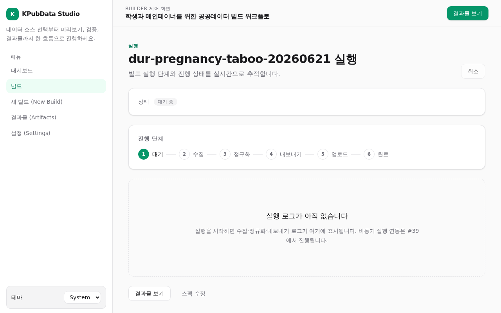
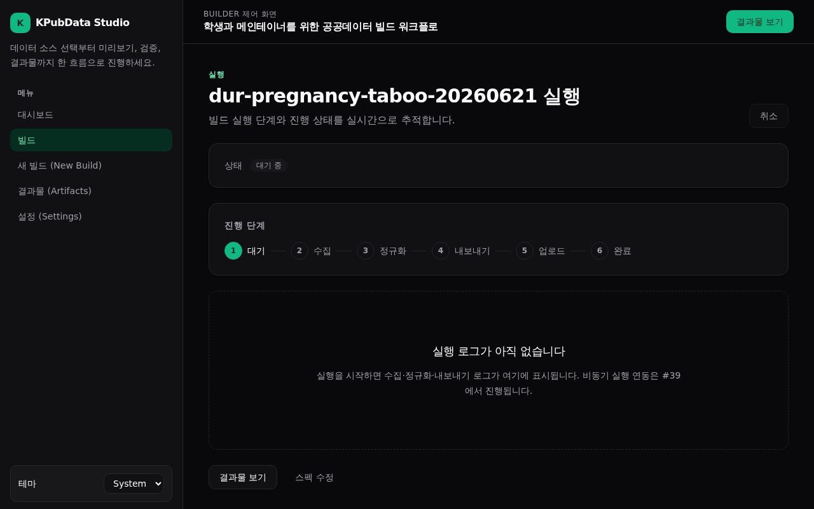

# 화면 설계서 — 빌드 실행 추적 (Build Run)

## 화면 개요

빌드 실행 과정을 단계별 스텝퍼로 추적하는 화면입니다. 수집부터 업로드까지 진행 상황을 보여주고, 완료 후 결과물·스펙 수정으로 이동합니다.

## 라우트 및 진입·이탈

| 항목 | 내용 |
| :--- | :--- |
| 라우트 | `/builds/:buildId/run` |
| 컴포넌트 | `src/pages/BuildRunPage.tsx` |
| 진입점 | [빌드 상세](build-detail.md) "실행하기", [새 빌드](new-build.md) 실행 |
| 이탈점 | [빌드 결과물](build-artifacts.md), 스펙 수정 → [빌드 편집](build-edit.md) |

## 주요 UI 구성요소

| 구성요소 | 설명 |
| :--- | :--- |
| 실행 스텝퍼 | `RUN_STEPS`: 대기 → 수집 → 정규화 → 내보내기 → 업로드 → 완료 |
| 상태 배지 | `StatusBadge`(예: queued) |
| 로그 영역 | 실행 로그 자리(EmptyState 자리표시) |
| 이동 링크 | "결과물 보기" · "스펙 수정" |

## 상태 및 상호작용

- 현재는 정적 표시입니다. 비동기 실시간 실행 추적은 향후(#39) 반영됩니다.
- 스텝퍼로 실행 단계를, 배지로 현재 상태를 표시합니다.
- 로그 영역은 EmptyState 자리표시로 준비되어 있습니다.

## 데이터 소스

- `buildId` 경로 파라미터. 실시간 실행/로그 연동은 예정(#39).

## 접근성

- 각 실행 단계는 스텝퍼로 시각화되어 현재 진행 위치를 전달합니다.

## 스크린샷

=== "라이트 테마 (Light)"
    

=== "다크 테마 (Dark)"
    

## 관련 문서

- [사용자 흐름](../USER_FLOWS.md) — 에러 시나리오·복구 흐름
- [상태 모델](../STATE_MODEL.md)
