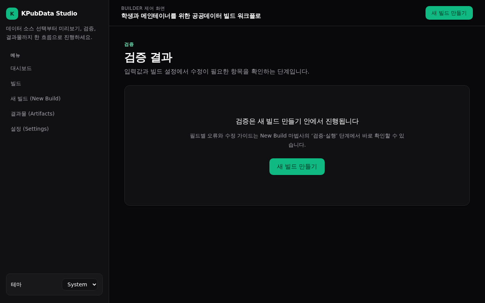

# 화면 설계서 — 검증 (Validate, 레거시)

## 화면 개요

과거 독립 검증 화면의 딥링크를 위한 레거시 스텁입니다. 검증 기능은 현재 [새 빌드 만들기](new-build.md) 마법사의 "검증·실행" 단계로 통합되었으며, 이 화면은 사용자를 마법사로 안내합니다.

## 라우트 및 진입·이탈

| 항목 | 내용 |
| :--- | :--- |
| 라우트 | `/validate` |
| 컴포넌트 | `src/pages/ValidatePage.tsx` |
| 진입점 | 외부/과거 딥링크 |
| 이탈점 | [새 빌드 만들기](new-build.md) 마법사 |

## 주요 UI 구성요소

- `EmptyState`: 검증이 마법사에 통합되었음을 알리고 새 빌드로 이동을 유도.

## 상태 및 상호작용

- 항상 안내용 `EmptyState`를 표시하며, 실제 검증 로직은 포함하지 않습니다.
- 검증 실행은 마법사의 `validateSpec` 단계에서 수행됩니다.

## 데이터 소스

- 없음(정적 안내 화면).

## 접근성

- 안내 문구와 이동 링크로 다음 행동을 명확히 제시합니다.

## 스크린샷

=== "라이트 테마 (Light)"
    

=== "다크 테마 (Dark)"
    

## 관련 문서

- [새 빌드 만들기](new-build.md) — 검증 단계 통합
